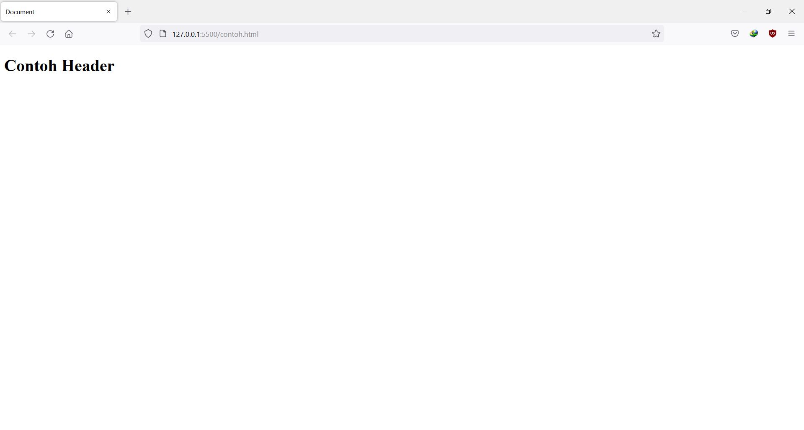
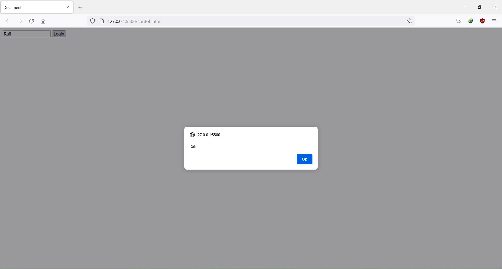

# Week 2

## A. _Javascript Dasar Scope_

- Scope merupakan sebuah konsep dalam flow data variabel.
- Menentukan suatu variabel bisa diakses pada scope tertentu atau tidak.
- Contoh analogi dari scope yaitu :

```sh
Kita semua bisa melihat bintang-bintang di langit karena bumi bersifat global.Tetapi, kita tidak akan bisa melihat monas yang berada di jakarta karena kita tinggal di Surabaya. Monas tersebut bersifat local yaitu hanya berada di Jakarta.
```

**_BLOCKS_**

- Blocks merupakan code yang berada didalam curly braces {}.
- Contoh penggunaan dari Blocks yaitu pada Conditional, Function, dan Looping

**_GLOBAL SCOPE dan LOCAL SCOPE_**

- Global scope adalah variabel yang kita buat dapat diakses dimanapun dalam suatu file dan harus dideklarasikan di luar Blocks.
- Contoh :

```js
let nama = "Rafi";

function show() {
  return nama;
}

console.log(nama);
// Output : 'Rafi'
// variabel nama dideklarasikan secara global scope
```

- Local scope adalah mendeklarasikan variabel didalam blocks seperti function, conditional, dan looping dan variabel hanya bisa diakses di dalam Blocks saja, tidak bisa diakses di luar blocks.
- Contoh :

```js
function show() {
  let nama = "Rafi";
  return nama;
}

console.log(show()); // Output : Rafi
console.log(nama); // Output : ReferenceError: nama is not defined
```

## B. _Javascript Dasar Function_

- Seorang programmer tidak mungkin membuat code yang sama tapi dengan jumlah yang banyak berulang kali, maka dari itu kita membutuhkan peran dari function()
- Function merupakan sebuah blok kode dalam sebuah grup untuk menyelesaikan 1 task/1 fitur dan kita dapat menggunakannya kembali ketika kita membutuhkannya
- Contoh Function :

```js
function show() {
  return "Halo";
}
```

- Contoh pemanggilan Function :

```js
function show() {
  return "Halo";
}
console.log(show() + " " + "Rafi");
// Output : Halo Rafi
```

- Function dapat menerima sebuah inputan data dan menggunakannya untuk melakukan task/tugas dengan parameter
- Saat membuat function, kita harus tahu data yang dibutuhkan. Misal saat membuat function penambahan 2 buah nilai. Data yang dibutuhkan adalah 2 buah nilai tersebut.
- Contoh :

```js
function tambah(a, b) {
  return a + b;
}
// a, b = parameter
```

- Argumen merupakan nilai yang digunakan saat memanggil function.
- Contoh :

```js
function tambah(a, b) {
  return a + b;
}

console.log(tambah(1, 2));
// 1, 2 = argumen
```

- function sangat dibutuhkan agar kita dapat dengan mudah memanage code dan tracing code jika ada error pada saat kita mengembangkan aplikasi dengan skala yang besar.
- Default paramaters digunakan untuk memberikan nilai awal/default pada parameter function dan jika kita ingin menjaga function agar tidak error saat dipanggil tanpa argumen.
- Contoh :

```js
function greet(nama = "Rafi") {
  return "Halo " + nama;
}
console.log(greet()); // Output : Halo Rafi
console.log(greet("Andi")); // Output : Halo Andi
```

- Kita bisa menggunakan function yang sudah dibuat pada function lain (Function Helper).
- Contoh :

```js
function contoh1(angka1) {
  return angka1 + 1;
}

function contoh2(angka2) {
  return contoh1(angka2) + 5;
}

console.log(contoh2(5)); // Output = 11
```

- Arrow function merupakan cara lain menuliskan function. Ini adalah fitur terbaru yang ada pada ES6.
- Contoh :

```js
const greet = () => {
  return "Halo";
};
```

- Short Syntax Function :

1. Zero Parameters :

```js
const namaFunction = () => {};
```

2. One Parameter

```js
const namaFunction = (parameter1) => {};
```

3. Two or More Parameters

```js
const namaFunction = (parameter1, parameter2) => {};
```

4. Single-Line Block

```js
const sumNumbers = (number) => number + number;
```

5. Multi-Line Block

```js
const sumNumbers = (number) => {
  const sum = number + number;
  return sum; // return statement
};
```

**- Error & Bug**

- Bug adalah kesalahan pada aplikasi yang menghasilkan hasil yang tidak diinginkan sehingga aplikasi tidak berfungsi sebagaimana mestinya atau crash. Bug umumnya lebih umum dalam dunia perangkat lunak dibandingkan dengan perangkat keras.
- Error adalah suatu kesalahan dari pihak developer dan menyebabkan kita tidak dapat mengkompilasi atau menjalankan aplikasi tersebut karena kesalahan pengkodean. Misalnya, seorang programmer mengetik nama variabel secara tidak benar.
- Error object dikeluarkan ketika kesalahan runtime terjadi. Error object juga dapat digunakan sebagai objek dasar untuk pengecualian yang ditentukan oleh pengguna.
- Error merupakan objek serializable, sehingga dapat dikloning dengan StructureClone() atau disalin antara 'pengembang' menggunakan postMessage().

- **_ERROR TYPES :_**

EvalError

    Membuat instance yang mewakili kesalahan yang terjadi terkait fungsi global eval().

RangeError

    Membuat instance yang mewakili kesalahan yang terjadi saat variabel numerik atau parameter berada di luar rentang validnya.

ReferenceError

    Membuat instance yang mewakili kesalahan yang terjadi saat mereferensikan referensi yang tidak valid.

SyntaxError

    Membuat instance yang mewakili kesalahan sintaks.

TypeError

    Membuat instance yang mewakili kesalahan yang terjadi saat variabel atau parameter bukan tipe yang valid.

URIError

    Membuat instance yang mewakili kesalahan yang terjadi saat encodeURI() atau decodeURI() melewati parameter yang tidak valid.

AggregateError

    Membuat instance yang mewakili beberapa kesalahan yang dibungkus dalam satu kesalahan ketika beberapa kesalahan perlu dilaporkan oleh suatu operasi, misalnya oleh Promise.any().

InternalError Non-standard

    Membuat instance yang mewakili kesalahan yang terjadi saat kesalahan internal di mesin JavaScript dilemparkan. Misalnya. "terlalu banyak rekursi"

- **CONSTRUCTOR Error()** : Membuat objek Kesalahan baru.
- **Static Methods** :

Error.captureStackTrace() (Tidak standar)

    Fungsi V8 non-standar yang membuat properti stack pada instance Error.

Error.stackTraceLimit (Non-standar)

    Properti numerik V8 non-standar yang membatasi jumlah bingkai tumpukan untuk disertakan dalam pelacakan tumpukan kesalahan.

Error.prepareStackTrace() (Non-standar dan Opsional)

    Fungsi V8 non-standar yang, jika disediakan oleh kode pengguna, dipanggil oleh mesin JavaScript V8 untuk pengecualian yang dilontarkan, memungkinkan pengguna menyediakan pemformatan khusus untuk pelacakan tumpukan.

- **Instance Properties** :

Error.prototype.message

    Pesan eror. Untuk objek Error yang dibuat pengguna, ini adalah string yang disediakan sebagai argumen pertama konstruktor.

Error.prototype.name

    Nama kesalahan. Ini ditentukan oleh fungsi konstruktor.

Error.prototype.cause

    Penyebab kesalahan yang menunjukkan alasan mengapa kesalahan saat ini terjadi — biasanya kesalahan lain yang tertangkap. Untuk objek Error yang dibuat pengguna, ini adalah nilai yang diberikan sebagai properti penyebab argumen kedua konstruktor.

Error.prototype.fileName (Non-standar)

    Properti Mozilla non-standar untuk jalur ke file yang memunculkan kesalahan ini.

Error.prototype.lineNumber (Non-standar)

    Properti Mozilla non-standar untuk nomor baris dalam file yang memunculkan kesalahan ini.

Error.prototype.columnNumber (Non-standar)

    Properti Mozilla non-standar untuk nomor kolom di baris yang memunculkan kesalahan ini.

Error.prototype.stack (Non-standar)

    Properti non-standar untuk pelacakan tumpukan.

- **Instance Methods** :

Error.prototype.toString()

    Mengembalikan string yang mewakili objek yang ditentukan. Mengganti metode Object.prototype.toString().

- Contoh Membuat Error Object :

```js
try {
  throw new Error("Whoops!");
} catch (e) {
  console.error(`${e.name}: ${e.message}`);
}
// Output : Error: Whoops!
```

## D. _Data Type Built in Prototype & Method_

**_- JavaScript data types and data structures_**

- Semua bahasa pemrograman memiliki struktur data bawaan, tetapi berbeda dari satu bahasa ke bahasa lainnya.
- Himpunan tipe dalam bahasa JavaScript terdiri dari primitive values dan objek.
- Primitive Values : tidak dapat diubah diwakili langsung di tingkat terendah bahasa.
- List primitive values, yaitu :

1. Boolean : memiliki dua nilai, yaitu true dan false
2. Null : Tipe Null memiliki satu nilai, yaitu null
3. Undefined : Variabel yang belum diberi nilai memiliki nilai yang tidak ditentukan.
4. Number : Nilai IEEE 754 format biner 64-bit presisi ganda
5. BigInt : Primitif numerik dalam JavaScript yang dapat mewakili bilangan bulat dengan presisi arbitrer. Dengan BigInts, Anda dapat dengan aman menyimpan dan mengoperasikan bilangan bulat besar bahkan di luar batas bilangan bulat aman untuk Numbers.
6. String : Digunakan untuk mewakili data tekstual. Ini adalah satu set "elemen" dari nilai integer 16-bit unsigned. Setiap elemen dalam String menempati posisi dalam String. Elemen pertama berada pada indeks 0, berikutnya pada indeks 1, dan seterusnya. Panjang dari sebuah String adalah jumlah elemen di dalamnya.
7. Symbol : Nilai primitif yang unik dan tidak dapat diubah dan dapat digunakan sebagai kunci dari properti Objek (lihat di bawah). Dalam beberapa bahasa pemrograman, Simbol disebut "atom".

- Objek : Koleksi dari properti
- Pada javaScript, objek dapat dilihat sebagai kumpulan properti. Dengan sintaks literal objek, sekumpulan properti terbatas diinisialisasi; maka properti dapat ditambahkan dan dihapus. Nilai properti dapat berupa nilai jenis apa pun, termasuk objek lain, yang memungkinkan membangun struktur data yang kompleks. Properti diidentifikasi menggunakan nilai kunci. Nilai kunci adalah string value atau symbol value.
- Ada dua jenis properti objek, yaitu data property dan accessor property. Setiap properti memiliki atribut yang sesuai.
- Data Property : Menghubungkan key dengan value.
- Accessor Property : Menghubungkan key dengan salah satu dari dua fungsi accessor (get dan set) untuk mengambil atau menyimpan nilai.
- Operator typeof dapat membantu Anda menemukan tipe variabel.

**_- STRING_**

- Objek String digunakan untuk mewakili dan memanipulasi urutan karakter.
- String digunakan untuk menyimpan data yang dapat direpresentasikan dalam bentuk teks. Beberapa operasi yang sering digunakan pada string adalah memeriksa panjangnya (length), membangun dan menggabungkannya menggunakan operator string + dan +=, memeriksa keberadaan atau lokasi substring dengan metode indexOf(), atau mengekstrak substring dengan substring () metode.
- Contoh String :

```js
const contoh = "Ini adalah contoh string";
```

- Ada dua cara untuk mengakses karakter individu dalam sebuah string :

1. CharAt()

```js
"cat".charAt(1); // gives value "a"
```

1. Cara lain adalah memperlakukan string sebagai objek seperti array :

```js
"cat"[1]; // gives value "a"
```

- Perhatikan bahwa JavaScript membedakan antara objek String dan primitive string value. (Hal yang sama berlaku untuk Boolean dan Numbers.)
- Objek String selalu dapat dikonversi ke mitra primitifnya dengan method valueOf().
- Template Literal `${x}` : Melakukan langkah-langkah pemaksaan string yang dijelaskan di atas untuk ekspresi yang disematkan.
- The String() function : String(x) menggunakan algoritma yang sama untuk mengonversi x, kecuali bahwa Simbol tidak mengeluarkan TypeError, tetapi mengembalikan "Simbol(deskripsi)", di mana deskripsi adalah deskripsi Simbol.
- Menggunakan operator + : "" + x, Memaksa operan ke primitif alih-alih string, dan, untuk beberapa objek, memiliki perilaku yang sama sekali berbeda dari paksaan string normal.
- Terkadang, sebuah kode akan menyertakan string yang sangat panjang. kita dapat memecah string menjadi beberapa baris dalam source code tanpa mempengaruhi konten string yang sebenarnya. (Menggunakan + operator)
- Contoh :

```js
const longString = "This is a very long string which needs " + "to wrap across multiple lines because " + "otherwise my code is unreadable.";
```

- Kita juga dapat menggunakan garis miring terbalik (\) di akhir setiap baris untuk menunjukkan bahwa string akan berlanjut pada baris berikutnya. Pastikan tidak ada spasi atau karakter lain setelah garis miring terbalik (kecuali untuk jeda baris), atau sebagai indentasi;.
- Contoh :

```js
const longString =
  "This is a very long string which needs \
to wrap across multiple lines because \
otherwise my code is unreadable.";
```

- **Constructor (String())** : Membuat objek String baru. Ia melakukan konversi tipe ketika dipanggil sebagai fungsi, bukan sebagai konstruktor, yang biasanya lebih berguna.
- **Static Method** :

1. String.fromCharCode() : Mengembalikan string yang dibuat dengan menggunakan urutan nilai Unicode yang ditentukan.
2. String.fromCodePoint() : Mengembalikan string yang dibuat dengan menggunakan urutan titik kode yang ditentukan.
3. String.raw() : Mengembalikan string yang dibuat dari string template mentah.

- **Instance Properties** (String.prototype.length) : mencerminkan panjang string. Read Only.
- **Instance Methods** :

String.prototipe.at()

    Mengembalikan karakter (tepatnya satu unit kode UTF-16) pada indeks yang ditentukan. Menerima bilangan bulat negatif, yang menghitung mundur dari karakter string terakhir.

String.prototipe.charAt()

    Mengembalikan karakter (tepatnya satu unit kode UTF-16) pada indeks yang ditentukan.

String.prototipe.charCodeAt()

    Mengembalikan angka yang merupakan nilai unit kode UTF-16 pada indeks yang diberikan.

String.prototype.codePointAt()

    Mengembalikan bilangan bulat non-negatif yang merupakan nilai titik kode dari titik kode yang disandikan UTF-16 mulai dari pos yang ditentukan.

String.prototipe.concat()

    Menggabungkan teks dari dua (atau lebih) string dan mengembalikan string baru.

String.prototype.includes()

    Menentukan apakah string panggilan berisi searchString.

String.prototype.endsWith()

    Menentukan apakah string diakhiri dengan karakter string searchString.

String.prototipe.indexOf()

    Mengembalikan indeks di dalam objek String pemanggilan dari kemunculan pertama searchValue, atau -1 jika tidak ditemukan.

String.prototype.lastIndexOf()

    Mengembalikan indeks di dalam objek String pemanggilan terakhir dari searchValue, atau -1 jika tidak ditemukan.

String.prototipe.localeCompare()

    Mengembalikan angka yang menunjukkan apakah string referensi compareString muncul sebelum, sesudah, atau setara dengan string yang diberikan dalam urutan pengurutan.

String.prototipe.match()

    Digunakan untuk mencocokkan ekspresi reguler regexp dengan string.

String.prototipe.matchAll()

    Mengembalikan iterator dari semua kecocokan regexp.

String.prototype.normalize()

    Mengembalikan Bentuk Normalisasi Unicode dari nilai string panggilan.

String.prototipe.padEnd()

    Pads string saat ini dari akhir dengan string yang diberikan dan mengembalikan string baru dengan panjang targetLength.

String.prototype.padStart()

    Mengisi string saat ini dari awal dengan string tertentu dan mengembalikan string baru dengan panjang targetLength.

String.prototipe.repeat()

    Mengembalikan string yang terdiri dari elemen objek berulang kali menghitung.

String.prototype.replace()

    Digunakan untuk mengganti kemunculan searchFor menggunakan replaceWith. searchFor dapat berupa string atau Regular Expression, dan replaceWith dapat berupa string atau fungsi.

String.prototype.replaceAll()

    Digunakan untuk mengganti semua kemunculan searchFor menggunakan replaceWith. searchFor dapat berupa string atau Regular Expression, dan replaceWith dapat berupa string atau fungsi.

String.prototipe.search()

    Cari kecocokan antara ekspresi reguler regexp dan string panggilan.

String.prototipe.slice()

    Mengekstrak bagian string dan mengembalikan string baru.

String.prototipe.split()

    Mengembalikan larik string yang diisi dengan memisahkan string panggilan pada kemunculan substring sep.

String.prototype.startsWith()

    Menentukan apakah string panggilan dimulai dengan karakter string searchString.

String.prototipe.substring()

    Mengembalikan string baru yang berisi karakter string panggilan dari (atau di antara) indeks (atau indeks) yang ditentukan.

String.prototype.toLocaleLowerCase()

    Karakter dalam string diubah menjadi huruf kecil dengan tetap menghormati lokal saat ini.

    Untuk sebagian besar bahasa, ini akan mengembalikan sama seperti toLowerCase().

String.prototype.toLocaleUpperCase([locale, ...locales])

    Karakter dalam string diubah menjadi huruf besar dengan tetap menghormati lokal saat ini.

    Untuk sebagian besar bahasa, ini akan mengembalikan sama seperti toUpperCase().

String.prototype.toLowerCase()

    Mengembalikan nilai string panggilan yang dikonversi menjadi huruf kecil.

String.prototipe.toString()

    Mengembalikan string yang mewakili objek yang ditentukan. Mengganti metode Object.prototype.toString().

String.prototipe.toUpperCase()

    Mengembalikan nilai string panggilan yang dikonversi menjadi huruf besar.

String.prototipe.trim()

    Memangkas spasi putih dari awal dan akhir string.

String.prototipe.trimStart()

    Memangkas spasi putih dari awal string.

String.prototipe.trimEnd()

    Memotong spasi putih dari akhir string.

String.prototype.valueOf()

    Mengembalikan nilai primitif dari objek yang ditentukan. Mengganti metode Object.prototype.valueOf().

String.prototipe[@@iterator]()

    Mengembalikan objek iterator baru yang berulang pada titik kode dari nilai String, mengembalikan setiap titik kode sebagai nilai String.

**_- NUMBER_**

- Number adalah objek pembungkus primitif yang digunakan untuk mewakili dan memanipulasi angka.
- Konstruktor Number berisi constants dan method untuk bekerja dengan angka. Nilai dari tipe lain dapat dikonversi ke angka menggunakan fungsi Number().
- Contoh :

```js
123; // one-hundred twenty-three
123.0; // same
123 === 123.0; // true
```

- Angka literal seperti 37 dalam kode JavaScript adalah nilai floating-point, bukan bilangan bulat.
- Saat digunakan sebagai fungsi, Number(value) mengonversi string atau nilai lain ke tipe Number. Jika nilainya tidak dapat dikonversi, ia mengembalikan 'NaN'.
- Contoh :

```js
Number("123"); // returns the number 123
Number("123") === 123; // true

Number("unicorn"); // NaN
Number(undefined); // NaN
```

- **CONSTRUCTOR Number()** : Membuat nilai angka baru.
- **STATIC PROPERTIES** :

Number.EPSILON

    Interval terkecil antara dua angka yang dapat diwakili.

Number.MAX_SAFE_INTEGER

    Integer aman maksimum dalam JavaScript (253 - 1).

Number.MAX_VALUE

    Angka terwakili positif terbesar.

Number.MIN_SAFE_INTEGER

    Integer aman minimum dalam JavaScript (-(253 - 1)).

Number.MIN_VALUE

    Angka terkecil yang dapat diwakili positif—yaitu, angka positif yang paling dekat dengan nol (tanpa benar-benar menjadi nol).

Number.NaN

    Nilai khusus "Bukan Angka".

Number.NEGATIVE_INFINITY

    Nilai khusus mewakili tak terhingga negatif. Dikembalikan pada overflow.

Number.POSITIVE_INFINITY

    Nilai khusus yang mewakili tak terhingga. Dikembalikan pada overflow.

Number.prototype

    Memungkinkan penambahan properti ke objek Number.

- **STATIC METHODS** :

Nomor.isNaN()

    Tentukan apakah nilai yang diteruskan adalah NaN.

Number.isFinite()

    Tentukan apakah nilai yang diteruskan adalah bilangan berhingga.

Nomor.isInteger()

    Tentukan apakah nilai yang diteruskan adalah bilangan bulat.

Nomor.isSafeInteger()

    Tentukan apakah nilai yang diteruskan adalah bilangan bulat aman (angka antara -(253 - 1) dan 253 - 1).

Nomor.parseFloat()

    Ini sama dengan fungsi parseFloat() global.

Nomor.parseInt()

    Ini sama dengan fungsi parseInt() global.

- **INSTANCE METHODS** :

Number.prototype.toExponential()

    Mengembalikan string yang mewakili angka dalam notasi eksponensial.

Nomor.prototipe.toFixed()

    Mengembalikan string yang mewakili angka dalam notasi titik tetap.

Nomor.prototipe.toLocaleString()

    Mengembalikan string dengan representasi sensitif bahasa dari nomor ini. Mengganti metode Object.prototype.toLocaleString().

Number.prototype.toPrecision()

    Mengembalikan string yang mewakili angka ke presisi tertentu dalam notasi titik tetap atau eksponensial.

Nomor.prototipe.toString()

    Mengembalikan string yang mewakili objek yang ditentukan dalam radix yang ditentukan ("basis"). Mengganti metode Object.prototype.toString().

Number.prototype.valueOf()

    Mengembalikan nilai primitif dari objek yang ditentukan. Mengganti metode Object.prototype.valueOf().

- Contoh dari mengonversi objek Date menjadi nilai numerik menggunakan Number :

```js
const d = new Date("December 17, 1995 03:24:00");
console.log(Number(d));
// Output : 819199440000
```

- Mengubah string numerik dan null menjadi angka :

```js
Number("123"); // 123
Number("123") === 123; // true
Number("12.3"); // 12.3
Number("12.00"); // 12
Number("123e-1"); // 12.3
Number(""); // 0
Number(null); // 0
Number("0x11"); // 17
Number("0b11"); // 3
Number("0o11"); // 9
Number("foo"); // NaN
Number("100a"); // NaN
Number("-Infinity"); // -Infinity
```

**_- MATCH_**

- Math adalah objek bawaan yang memiliki properti dan metode untuk konstanta dan fungsi matematika dan bukan merupakan objek fungsi.
- Math berfungsi dengan tipe Number dan tidak bekerja dengan BigInt.
- Tidak seperti banyak objek global lainnya, Math bukanlah sebuah konstruktor. Semua properti dan metode Math bersifat statis.

- **STATIC PROPERTIES** :

Math.E

    Konstanta Euler dan basis logaritma natural; sekitar 2,718.

Math.LN2

    Logaritma natural dari 2; sekitar 0,693.

Math.LN10

    Logaritma natural 10; sekitar 2,303.

Math.LOG2E

    logaritma basis-2 dari E; sekitar 1,443.

Math.LOG10E

    logaritma basis-10 dari E; sekitar 0,434.

Math.PI

    Rasio keliling lingkaran dengan diameternya; sekitar 3.14159.

Math.SQRT1_2

    Akar kuadrat dari 1/2; sekitar 0,707.

Math.SQRT2

    Akar kuadrat dari 2; sekitar 1,414.

- **STATIC METHODS**

Math.ab()

    Mengembalikan nilai absolut dari x.

Math.acos()

    Mengembalikan arccosinus dari x.

Math.acosh()

    Mengembalikan arccosinus hiperbolik dari x.

Math.asin()

    Mengembalikan arcsine dari x.

Math.asinh()

    Mengembalikan arcsinus hiperbolik suatu bilangan.

Math.atan()

    Mengembalikan arctangent dari x.

Math.atanh()

    Mengembalikan arktangen hiperbolik dari x.

Math.atan2()

    Mengembalikan arctangent dari hasil bagi argumennya.

Math.cbrt()

    Mengembalikan akar pangkat tiga dari x.

Math.ceil()

    Mengembalikan bilangan bulat terkecil yang lebih besar dari atau sama dengan x.

Math.clz32()

    Mengembalikan jumlah bit nol terdepan dari bilangan bulat 32-bit x.

Math.cos()

    Mengembalikan kosinus dari x.

Math.cosh()

    Mengembalikan kosinus hiperbolik dari x.

Math.exp()

    Mengembalikan ex, di mana x adalah argumen, dan e adalah konstanta Euler (2,718…, basis logaritma natural).

Math.expm1()

    Mengembalikan pengurangan 1 dari exp(x).

Math.floor()

    Mengembalikan bilangan bulat terbesar yang kurang dari atau sama dengan x.

Math.round()

    Mengembalikan representasi float presisi tunggal terdekat dari x.

Math.hipot()

    Mengembalikan akar kuadrat dari jumlah kuadrat argumennya.

Math.imul()

    Mengembalikan hasil perkalian bilangan bulat 32-bit dari x dan y.

Math.log()

    Mengembalikan logaritma natural (㏒e; juga, ) dari x.

Math.log1p()

    Mengembalikan logaritma natural (㏒e; juga ) dari 1 + x untuk bilangan x.

Math.log10()

    Mengembalikan logaritma basis-10 dari x.

Math.log2()

    Mengembalikan logaritma basis-2 dari x.

Math.maks()

    Mengembalikan bilangan terbesar dari nol atau lebih.

Math.min()

    Mengembalikan angka terkecil dari nol atau lebih.

Math.pow()

    Mengembalikan basis x ke pangkat eksponen y (yaitu, xy).

Math.acak()

    Mengembalikan angka pseudo-acak antara 0 dan 1.

Math.bulat()

    Mengembalikan nilai bilangan x yang dibulatkan ke bilangan bulat terdekat.

Math.sign()

    Mengembalikan tanda x, yang menunjukkan apakah x positif, negatif, atau nol.

Math.sin()

    Mengembalikan sinus dari x.

Math.sinh()

    Mengembalikan sinus hiperbolik dari x.

Math.sqrt()

    Mengembalikan akar kuadrat positif dari x.

Math.tan()

    Mengembalikan tangen x.

Math.tanh()

    Mengembalikan tangen hiperbolik dari x.

Math.trunc()

    Mengembalikan bagian bilangan bulat dari x, menghapus setiap digit pecahan.

**_- PRIMITIVE dan NON-PRIMITIVE_**

- Kedua kategori mewakili dua cara berbeda terhadap tipe data yang disimpan ke dalam memori. Primitive disimpan berdasarkan nilai sedangkan Non-Primitive (Objek) disimpan berdasarkan referensi.
- **Primitive** :

1. Numbers
2. Strings
3. Booleans
4. Undefined
5. Null

- **Non-Primitive** :

1. Objects
2. Arrays
3. Functions

- Contoh bagaimana primitive **_stored_** :

```js
let a = 5;
let b = a;
console.log(a); // 5
console.log(b); // 5
console.log(a === b); // true

a = 10;
console.log(a); // 10
console.log(b); // 5
console.log(a === b); // false
```

- Penjelasan :

```sh
1. Membuat 2 variabel yaitu a dan b
2. a = 5
3. b = a
4. Lalu kita ubah a menjadi 10
5. Tetapi nilai dari b tetaplah 5.
```

- **Hal ini terjadi karena primitive disimpan berdasarkan value (nilai). Artinya, setiap kali kita mendeklarasikan variabel baru menggunakan tipe data primitive, kita membuat alamat baru di memori untuk nilai tersebut.**
- Contoh Non-Primitive (Objek) :

```js
let a = [10];
let b = a;
console.log(a === b); // true

a.push(10);
console.log(a); // [10, 10]
console.log(a === b); // true
```

- Penjelasan :

```sh
1. Membuat 2 variabel yaitu a dan b
2. a ditetapkan sama dengan array yang memiliki nilai tunggal: 10
3. b = a
4. Membandingkan a dan b menghasilkan true
5. Lalu ubah data di dalam a
6. Membandingkan lagi antara a dan b tetap menghasilkan true
```

- **Alasanya adalah karena Non-Primitive (Objek) disimpan dengan reference**
- Dalam kasus objek non-primitive, variabel menyimpan reference ke objek. Itu tidak membuat alamat baru untuk suatu nilai, hanya penunjuk ke objek. Ketika mengubah variabel yang menunjuk ke alamat, sebenarnya memodifikasi data yang disimpan di dalam alamat itu sendiri.

## E. _Javascript DOM_

- Kita bisa menggunakan DOM untuk mengambil data (seperti username dan password) sebelum diakses dalam database.
- Document Object Model (DOM) adalah sebuah antarmuka pemrograman untuk HTML, XML dan SVG yang bersifat lintas platform dan language-independent. Sebuah peramban web tidak harus menggunakan DOM untuk menampilkan dokumen HTML. Namun DOM diperlukan oleh JavaScript yang akan mengubah tampilan sebuah situs web secara dinamis.
- DOM bukan bagian dari JavaScript, melainkan browser (Web API).
- Standar DOM W3C dipisahkan menjadi 3 bagian berbeda:

1. Core DOM - model standar untuk semua jenis dokumen
2. XML DOM - model standar untuk dokumen XML
3. HTML DOM - model standar untuk dokumen HTML

- HTML DOM adalah model objek standar dan antarmuka pemrograman untuk HTML.
- HTML DOM merupakan standar untuk mendapatkan, mengubah, menambah, atau menghapus elemen HTML.

A. **Mencari Element HTML** :

```html
<!-- HTML -->
<body>
  <div>
    <div id="contoh1">
      <p>
        <span></span>
      </p>
    </div>
    <div class="contoh2"></div>
    <div class="contoh2"></div>
  </div>
</body>
```
```js
// Mencari element dengan id tertentu
document.getElementById("contoh1")

// Mencari beberapa element (sekaligus) dengan class tertantu 
document.getElementsByClassName("contoh2")

// Mencari Elemen Menggunakan kombinasi Selector seperti pada CSS
document.querySelector("#header p span")
```

B. **Mengubah Konten HTML** :
1. Element.textContent
```html
<body>
    <h1 id="contoh"></h1>
    <script src="contoh.js"></script>
</body>
```
```js
document.getElementById("contoh").textContent = "Ini adalah contoh"
```
- Output : 


2. Element.innerHTML
```html
<body>
    <ul id="contoh"></ul>
    <script src="contoh.js"></script>
</body>
``` 
```js
document.getElementById("contoh").innerHTML = "    <li>Contoh</li> <li>Contoh</li> <li>Contoh</li>"
```
- Output :
 


C. **Membuat Element HTML** :
```html
<body>
    <div id="header"></div>
    <script src="contoh.js"></script>
</body>
```
```js
const heading = document.createElement("h1")
heading.textContent = "Contoh Header"

document.getElementById("header").appendChild(heading)
```
- Output : 



D. **Interaksi User (Events)** 
- User experience itu bersifat dua arah: 
selain menampilkan element HTML, halaman web juga harus bisa menangkap interaksi user
- HTML DOM Event :
1. Change
2. Focus
3. Hover
4. Click
5. Blur
6. Scroll
7. Submit

D. **Menangkap Interaksi User**
1. Element.addEventListener(“event”) dan Element.onevent
**CONTOH PENGGUNAAN PADA DOM EVENT "CLICK"**
```html
<body>
    <input type="text" id="contoh">
    <button id="btn-contoh">Login</button>
    <script src="contoh.js"></script>
</body>
```
```js
const input = document.getElementById("contoh")
const button = document.getElementById("btn-contoh")

button.addEventListener("click", function() {
    alert(input.value)
})

// ATAU
button.onclick = function() {alert(input.value) }
```
- Output (ketika button sudah diklik) : 



 


