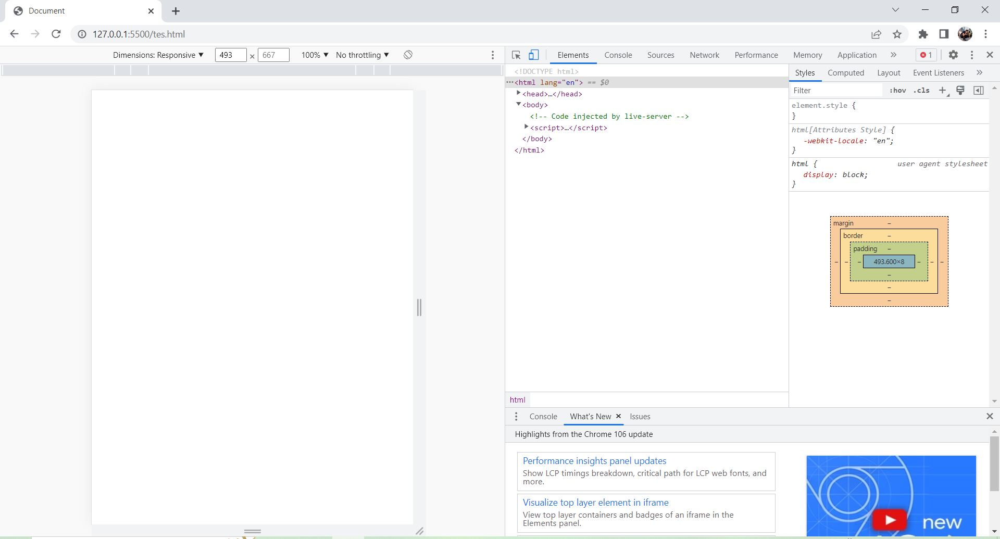
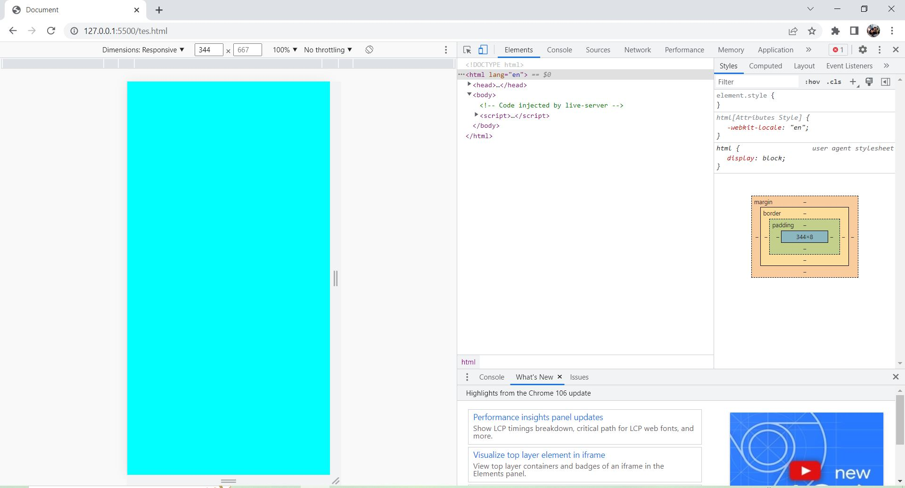

# Week 3

## A. _JavaScript Intermediate Asynchronous_

## - **Fetch**

- Fetch API pada javascript adalah kegiatan untuk meminta/request layanan ke endpoint/letak url yang akan menerima request pada website secara local maupun public, untuk mengambil response resource / sumber daya berupa data berformat json atau text yang biasa dilakukan programmer untuk membangun website yang membutuhkan data dari website lain ataupun website yang membutuhkan konsep microservice didalamnya.
- Contoh (Fetch dengan menggunakan Async dan Await mengambil dari API digimon):

```js
let getData = async () => {
  let response = await fetch("https://digimon-api.vercel.app/api/digimon");
  let digimon = await response.json();

  digimon.forEach((item, index) => {
    container.innerHTML += "<h3>${item.name}</h3>";
    console.log(item);
  });
};
```

- Contoh (Fetch dengan menggunakan promise mengambil dari API digimon) :

```js
fetch("https://digimon-api.vercel.app/api/digimon")
  .then((result) => {
    console.log(result);
    return result.json();
  })
  .then((result) => {
    console.log(result);
  });
```
## - **Async Await**

- Async/Await diperkenalkan di ES8 / ES2017 untuk menghandle operasi asynchronous dengan syntax yang lebih mirip dengan synchronous.
- Async/Await sendiri dibuat di atas Promise.
- Contoh :

```js
const getData = async () => {
  const data = await getUser();
  console.log(data);
};
```

- Penjelasan :

```sh
Pada contoh diatas, pertama kita memiliki function dengan menambahkan async didepan function yang mana berfungsi untuk menjadikan function tersebut asynchronous, dan await berfungsi menunda eksekusi hingga proses asynchronous selesai, dari kode di atas berarti console.log(data) tidak akan di eksekusi sebelum proses getUser() selesai. await juga bisa digunakan berkali-kali di dalam function.
```

- Async Await adalah salah satu cara untuk mengatasai masalah asynchronous pada Javascript selain menggunakan callback dan promise.
- Pada implementasi Async Await, kita menggunakan kata kunci async sebelum fungsi. Await sendiri hanya bisa digunakan pada fungsi yang menggunakan async.
- Tidak seperti Promise, dengan Async Await maka suatu baris kode dapat tersusun rapi, mirip dengan kode yang sifatnya synchronous.
- Setiap baris yang menggunakan await, akan ditunggu sampai Asynchronous Promise tersebut di resolve.
- Untuk menghandle error Async Await kita dapat menggunakan try catch di dalam function yang kita buat, sehingga jika terjadi error kita dapat menangkap errornya dalam block catch, berikut contoh penggunaannya.
- Contoh :

```js
const getData = async () => {
  try {
    const result = await getUser();
    console.log(result);
  } catch (error) {
    console.log(error);
  }
};
```

## C. _Git & Github Lanjutan_

- GIT merupakan tools untuk programmer dan sebagai version control system
- Tugas dari version control system yaitu mencatat setiap perubahan pada File (termasuk code yang kita buat) pada suatu proyek baik dikerjakan secara individu maupun tim.
- Git adalah aplikasi yang dapat melacak setiap perubahan yang terjadi pada suatu folder atau file. Git digunakan sebagai tempat penyimpanan file pemrograman mereka, karena lebih efektif.
- Tujuan dari penggunaan Git dan Github yaitu agar kita bisa berkolaborasi mengerjakan proyek yang sama tanpa harus repot copy dan paste folder aplikasi yang terupdate
- Git dan GitHub menangani commands secara berbeda. Developer yang menggunakan Git dapat menggunakan command-line tool, yaitu pengubah kode dan dapat digabungkan menuju perangkat lokal. Sedangkan, GitHub menyediakan interface grafis berbasis cloud sebagai tempat untuk melakukan seluruh tugas.
- **Setup Awal Git :**

1. git config global user.email rafipersonalporto@gmail.com (email yang digunakan harus sama dengan Github)
2. git config global user.name "Rafi"
3. git config --list untuk melihat hasil konfigurasi
4. git init (dilakukan pada folder yang dibuat) untuk membuka repository
5. git status untuk mengecek perubahan pada Git
6. git add . untuk menambahkan file baru pada Git
7. git commit -m "Pesan Commit" untuk menyimpan perubahan pada Git
8. git push -u origin master / main untuk mengirim file pada remote repository
9. git clone untuk mengambil repository lokal

- Contoh proses ketika kita akan memasukkan :

1. Membuat Repository pada Github
2. Git clone untuk menyalin file dari suatu repository GitHub ke dalam komputer kita.
3. git add .
4. git commit -m "Pesan Commit"
5. git push -u origin master / main untuk mengirim file pada remote repository

- Menggabungkan branch baru yang kita buat dengan branch master :

1. Misal kita baru saja menyelesaikan fitur login pada branch "login_page"
2. Kita pindah ke branch master

```sh
git checkout master
```

3. Setelah itu, kita bisa gabunggan dengan command

```sh
git merge login_page
```

4. Lalu kita bisa lihat file "login.html" akan berada pada branch master

- Conflict biasanya terjadi jika ada dua orang yang mengedit file yang sama, karena terdapat kemungkinan di cabang yang mereka kerjakan terdapat file yang sama dengan cabang lain. Kemudian, saat digabungkan akan terjadi conflict.
- Mengatasi suatu conflict adalah tugas dari pemilik atau pengelola repository.
- Contoh conflict beserta mengatasinya :

1. Kita pindah ke branch "login_page" dengan :

```sh
git checkout login_page
```

2. Setelah itu coba edit file login.html atau index.html, karena kedua file tersebut ada di kedua cabang yang akan kita gabungkan.

```sh
$ git diff
diff --git a/login.html b/login.html
index 23a3f5c..eea5658 100644
--- a/login.html
+++ b/login.html
@@ -1 +1 @@
- (kode untuk halaman login)
+<p>kode untuk halaman login<p>
```

3. Lalu kita lakukan commit kembali

```sh
git add login.html
git commit -m "revisi"
```

4. Kita coba pindah ke branch master, lalu lakukan perubahan yang sama seperti pada branch "login_page"
5. Setelah itu kita coba commit pada branch master

```sh
git add login.html
git commit -m "revisi"
```

6. Kita coba gabungkan antara branch master dan "login_page"

```sh
$ git merge login_page
Auto-merging login.html
CONFLICT (content): Merge conflict in login.html
Automatic merge failed; fix conflicts and then commit the result.
```

7. 2 kode branch dispisahkan dengan tanda ==== , lalu tugas kita adalah menghapus salah satu dari kode tersebut
   
   **MENJADI**
   
8. Lalu kita lakukan commit kembali untuk perubahan yang baru saja kita lakukan

```sh
git add login.html
git commit -m "revisi conflict"
```

9. Maka conflict akan menghilang

## D. _Responsive Web Design_

- Responsive Web Design digunakan agar desain website kita dapat diakses menggunakan device dengan jenis apapun karena ketika kita membuat sebuah aplikasi, kita juga harus memikirkan device yang digunakan oleh user kita seperti laptop dan smartphone
- Kita bisa menggunakan Chrome Dev Tools pada browser chrome sebagai tools dari Responsive Web Design dengan Ctrl + Shift + J, maka akan menghasilkan output :
  
- Setelah itu kita klik icon yang diberi lingkaran berwarna kuning (menggambarkan smartphone dan tablet).
- Dan akan menjadi :
  
- Meta Viewport sangat dibutuhkan ketika kita akan membuat Responsive Web Design
- Contoh :

```html
<!DOCTYPE html>
<html lang="en">
  <head>
    <meta charset="UTF-8" />
    <meta http-equiv="X-UA-Compatible" content="IE=edge" />
    <meta name="viewport" content="width=device-width, initial-scale=1.0" />
    <title>Contoh Responsive</title>
  </head>
  <body></body>
</html>
```

- Relative unit berguna untuk mendesain website yang responsif karena ukurannya bisa berubah relatif terhadap ukuran layar :

1. % : Ukurannya relatif terhadap parent element
2. em : Ukurannya relatif terhadap font-size dari elemen saat ini
3. rem : Ukurannya relatif terhadap font-size root elemen (<html>). "rem" = "root em"
4. ch : Ukurannya mengikuti jumlah karakter (1 karakter sama dengan lebar dari karakter 0/nol font yang sedang aktif)
5. vh : Ukurannya relatif terhadap tinggi viewport (ukuran jendela tau aplikasi), 1vh = 1/100 dari tinggi viewport
6. vw : Ukurannya relatif terhadap lebar dari viewport. 1vw = 1/100 lebar viewport
7. vmin : Ukurannya relatif terhadap ukuran viewport yang lebih kecil (misalnya diorientasi portrait, lebar akan lebih kecil daripada tinggi). 1vmin = 1/100 dari ukuran viewport yang lebih kecil.
8. vmax : Sama dengan vmin, dia akan melihat ukuran viewport yang lebih besar
9. ex : Ukurannya relatif terhadap tinggi dari karakter "x" kecil font yang sedang aktif.

- Contoh implementasi dari relative unit :

```css
.child {
  margin: 20%;
}
```

- Penjelasan :

```sh
Ketika kita menginginkan sebuah child element memiliki 20% lebar parent sebagai marginnya sehingga tidak akan mengisi keseluruhan parent. Ketika ukuran parent berubah, maka margin juga akan berubah.
```

- Untuk memudahkan dalam membuat Responsive Web Design, kita dapat menggunakan media query.
- Terdapat 2 jenis media query untuk Responsive Web Design, yaitu :

1. max-width
2. min-width

- Contoh :

```css
@media screen and (max-width: ukuran-pixel) {
}
```

- Contoh implementasi dari media query :

```html
<!DOCTYPE html>
<html lang="en">
  <head>
    <meta charset="UTF-8" />
    <meta http-equiv="X-UA-Compatible" content="IE=edge" />
    <meta name="viewport" content="width=device-width, initial-scale=1.0" />
    <title>Document</title>
    <link rel="stylesheet" href="tes.css" />
  </head>
  <body></body>
</html>
```

```css
@media screen and (max-width: 400px) {
  body {
    background-color: aqua;
  }
}
```

- Output :


**Tampilan web ketika width > 400px**


**Tampilan web ketika width < 400px**

- Grid merupakan susunan kerangka yang dibangun atas garis dengan posisi vertikal dan horizontal, grid dipergunakan sebagai alat bantu untuk menyusun atau mengatur objek dalam kontek perencanaan dalam ruang gambar dua dimensi.
- Contoh implementasi Grid :

```css
* {
  box-sizing: border-box;
}

.container {
  max-width: 1280px;
  margin: 0 auto;
  display: grid;
}

.container::after {
  content: "";
  clear: both;
  display: table;
}

[class*="grid"] {
  float: left;
  padding: 15px;
}

.grid1 {
  width: calc((1 / 12) * 100%);
}
.grid2 {
  width: calc((2 / 12) * 100%);
}
.grid3 {
  width: calc((3 / 12) * 100%);
}
.grid4 {
  width: calc((4 / 12) * 100%);
}
.grid5 {
  width: calc((5 / 12) * 100%);
}
.grid6 {
  width: calc((6 / 12) * 100%);
}
.grid7 {
  width: calc((7 / 12) * 100%);
}
.grid8 {
  width: calc((8 / 12) * 100%);
}
.grid9 {
  width: calc((9 / 12) * 100%);
}
.grid10 {
  width: calc((10 / 12) * 100%);
}
.grid11 {
  width: calc((11 / 12) * 100%);
}
.grid12 {
  width: calc((12 / 12) * 100%);
}
```

## E. _Bootstrap 5_

- Bootstrap merupakan salah satu andalan para developer ketika membuat sebuah website karena Bootstrap dapat membuat website dengan sangat cepat dan mudah.
- Bootstrap adalah framework HTML, CSS, dan JavaScript yang berfungsi untuk mendesain website responsive dengan cepat dan mudah. Bootstrap diciptakan pada tahun 2011 oleh Mark Otto dan Jacob Thornton dari Twitter.
- Class yang disediakan Bootstrap bisa dibilang cukup lengkap. Mulai dari class untuk layout halaman, class menu navigasi, class animasi, dan masih banyak lainnya.
- Bootstrap bersifat responsive berkat grid system yang digunakan. Sistem grid pada bootstrap menggunakan rangkaian containers, baris, dan kolom untuk menyesuaikan bentuk layout dan konten website yang berarti Bootstrap menjamin tampilan website Anda akan tetap rapi dan konsisten di berbagai perangkat pengunjung. Baik melalui smartphone, tablet, atau laptop.
- Beberapa komponen dasar dari bootstrap, yaitu :

1. Glyphicon
2. Dropdown
3. Button Group
4. Button Dropdown
5. Input Group
6. Navs
7. Navbar
8. Breadcrumbs
9. Pagination
10. Label
11. Badge
12. Jumbroton
13. Page Header
14. Thumbnails
15. Alerts
16. Progress Bar
17. Panels
18. Responsive Embed

- Contoh implementasi dari penggunaan bootstrap (content dan component serta responsive) :

```html
<!DOCTYPE html>
<html lang="en">
  <head>
    <meta charset="utf-8" />
    <meta name="viewport" content="width=device-width, initial-scale=1" />
    <title>Bootstrap demo</title>
    <link href="https://cdn.jsdelivr.net/npm/bootstrap@5.2.2/dist/css/bootstrap.min.css" rel="stylesheet" integrity="sha384-Zenh87qX5JnK2Jl0vWa8Ck2rdkQ2Bzep5IDxbcnCeuOxjzrPF/et3URy9Bv1WTRi" crossorigin="anonymous" />
  </head>
  <body>
    <div class="container">
      <div class="row">
        <div class="col-md-12" style="background-color: AntiqueWhite">
          <h1><center>Judul Halaman</center></h1>
        </div>
      </div>
      <div class="row">
        <div class="col-md-3" style="background-color: GreenYellow">
          <h2>Contoh Sidebar</h2>
          <p>Opsi 1</p>
          <p>Opsi 2</p>
          <p>Opsi 3</p>
          <p>Opsi 4</p>
        </div>
        <div class="col-md-9" style="background-color: LightCyan">
          <h2>Konten</h2>
          <p>Konten website dapat diisi pada bagian ini</p>
        </div>
      </div>
      <div class="row" style="background-color: MediumPurple">
        <div class="col-md-12">
          <h2><center>Footer</center></h2>
        </div>
      </div>
    </div>
    <script src="https://cdn.jsdelivr.net/npm/bootstrap@5.2.2/dist/js/bootstrap.bundle.min.js" integrity="sha384-OERcA2EqjJCMA+/3y+gxIOqMEjwtxJY7qPCqsdltbNJuaOe923+mo//f6V8Qbsw3" crossorigin="anonymous"></script>
  </body>
</html>
```

- Output :


  
