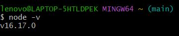
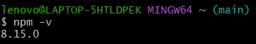
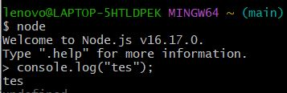
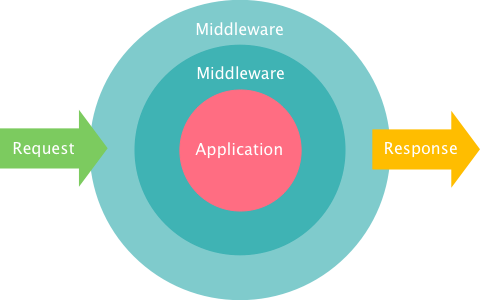
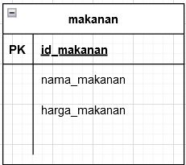
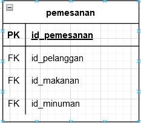
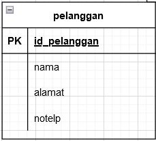
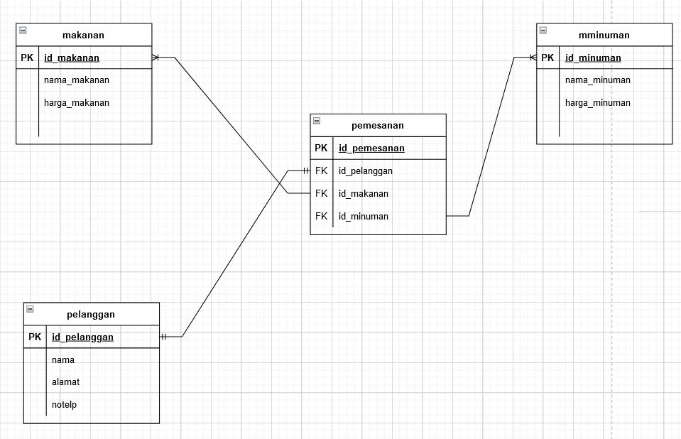

# Week 5

## A. _Web Server & RESTful API_

- Server web atau yang dalam bahasa inggris disebut web server adalah perangkat lunak (software) dalam server yang berfungsi untuk menerima permintaan (request) berupa halaman web melalui protokol HTTP dan atau HTTPS dari klien yang lebih dikenal dengan nama browser, kemudian mengirimkan kembali (respon) hasil permintaan tersebut ke dalam bentuk halaman-halaman web yang pada umumnya berbentuk dokumen HTML.
- 2 Komponen penting pada Web Server, yaitu :

1. Hardware
2. Software

- Pada Hardware, server web merupakan komputer yang menyimpan perangkat lunak server web dan file komponen situs web. (misalnya, dokumen HTML, gambar, CSS stylesheet, dan file JavaScript) Server web terhubung ke Internet dan mendukung pertukaran data fisik dengan perangkat lain yang terhubung ke web.
- Pada software, server web mencakup beberapa bagian yang mengontrol bagaimana pengguna web mengakses file yang dihosting. Minimal, ini adalah server HTTP. Server HTTP adalah perangkat lunak yang memahami URL (alamat web) dan HTTP (protokol yang digunakan browser Anda untuk melihat halaman web). Server HTTP dapat diakses melalui nama domain situs web yang disimpannya, dan mengirimkan konten situs web yang dihosting ini ke perangkat pengguna akhir.
- _Static web server_, atau _stack_, terdiri dari komputer (Hardware) dengan server HTTP (Software). Kami menyebutnya "statis" karena server mengirimkan file yang dihosting apa adanya ke browser.
- Sebuah _Dynamic Server Web_ terdiri dari server web statis yang ditambah perangkat lunak tambahan, seperti server aplikasi dan database. Disebut dinamis karena server aplikasi memperbarui file yang dihosting sebelum mengirim konten ke browser melalui server HTTP.
- Server Side Programming, atau Bahasa Pemrograman sisi server, adalah bahasa pemrograman web, yang letak source code nya nanti hanya ada di webserver. Bahasa ini source code nya tidak akan muncul di sisi client. Pada dasarnya server side programming ini memiliki arti yang sama dengan backend scripting.
- _Static Website_ atau Website statis adalah sebuah website yang kontennya statis / tidak berubah-ubah. Sekali dibuat dan online di Internet, pada umumnya website tersebut tidak dapat diubah kecuali diubah secara manual melalui pengubahan bahasa pemograman website tersebut.
- Website Dinamis atau _Dynamic Website_ adalah jenis halaman web yang disusun oleh konten dan layout yang memiliki banyak informasi didalamnya. Diberi nama website Dinamis karena kontennya dapat berubah-ubah. Dengan kata lain, adanya program yang berjalan untuk mengatur perubahan data yang ditampilkan dalam website Dinamis tersebut.
- Perbedaan antara Website Statis dan Website Dinamis :

1. Memiliki tujuan dan _Concern_ yang berbeda.
2. Biasanya menggunakan bahasa pemrograman yang berbeda (kecuali Javascript).
3. Berjalan pada lingkungan sistem operasi yang berbeda.

- REST memiliki kepanjangan dari REpresentational State Transfer yaitu gaya arsitektur untuk menyediakan standart antara sistem komputer pada web, sehingga memudahkan sistem untuk berkomunikasi satu sama lain. Implementasi klien dan server dapat dilakukan secara mandiri tanpa harus tahu satu sama lain.
- Di dalam REST, implementasi klien dan implementasi server dapat dilakukan secara independen tanpa saling mengetahui satu sama lain, ini berarti bahwa kode di sisi klien dapat diubah setiap saat tanpa mempengaruhi operasi server, dan kode di sisi server dapat diubah tanpa mempengaruhi operasi klien.
- Dengan menggunakan REST, klien yang berbeda dapat mencapai titik akhir REST yang sama, melakukan tindakan yang sama, dan menerima respons yang sama, klien dapat berupa platform web, platform seluler, atau platform desktop.
- **Membuat sebuah Request** : REST mengharuskan klien membuat permintaan / _Request_ ke server untuk mengambil atau mengubah data di server. Permintaan biasanya terdiri dari :

1. Sebuah HTTP verb, yang mendefinisikan jenis operasi apa yang harus dilakukan.
2. Sebuah header, yang memungkinkan klien untuk menyampaikan informasi tentang _Request_.
3. Sebuah jalan menuju _Resource_.
4. Suatu pesan opsional yang berisi data.

- **HTTP Verbs** : Terdapat 4 HTTP Verb dasar yang biasa digunakan dalam _Request_ untuk berinteraksi dengan sumber daya dalam sistem REST :

1. GET : untuk mengambil atau membaca data.
2. POST : untuk membuat (create) item/resource baru.
3. PUT : untuk mengupdate item/resource yang telah ada.
4. DELETE : untuk menghapus item/resource yang telah ada.

- Pada header Request, klien mengirimkan jenis konten yang dapat diterima dari server. Biasa disebut _Accept Field_, sertamemastikan bahwa server tidak mengirim data yang tidak dapat dipahami atau diproses oleh klien. Opsi untuk jenis konten adalah Jenis MIME (atau Ekstensi Surat Internet Serbaguna)
- Tipe lain yang biasanya digunakan :

1. image : image/png, image/jpeg, image/gif.
2. audio : audio/wav, audio/mpeg
3. video : video/mp4, video/ogg
4. application : application/json, application/pdf, application/xml, application/octet-stream

- Contoh : klien yang mengakses sumber daya dengan id 1 di sumber artikel di server mungkin mengirim permintaan GET seperti :

```sh
GET /articles/1
Accept: text/html, application/xhtml
```

- _Accept Header Field_ dalam hal ini menunjukkan bahwa klien akan menerima konten dalam teks/html atau aplikasi/xhtml.
- Sebuah Request harus berisi jalur (path) ke sumber daya tempat operasi harus dilakukan. Pada RESTful API, jalur (path) harus dirancang untuk membantu klien mengetahui apa yang sedang terjadi.
- Sebuah jalur (path) seperti **nike.com/customers/2/orders/20** jelas apa yang ingin dipilih / ditunjuk. Path ini bersifat hierarkis dan deskriptif. **Kita dapat melihat bahwa kita mengakses pesanan dengan id 20 untuk pelanggan dengan id 2.**
- _Content Types_ atau Tipe Konten : Ketika klien mengakses sumber daya dengan id 23 di sumber artikel dengan Request GET :

```sh
GET /articles/23 HTTP/1.1
Accept: text/html, application/xhtml
```

- Server mungkin mengirim kembali konten dengan header respon :

```sh
HTTP/1.1 200 (OK)
Content-Type: text/html
```

- _Response Code_ : Untuk setiap HTTP Verbs, ada kode status yang akan dikembalikan server setelah berhasil :

1. GET : Mengembalikan 200 (OK).
2. POST : Mengembalikan 201 (CREATED).
3. PUT : Mengembalikan200 (OK).
4. DELETE : Mengembalikan 204 (NO CONTENT).

- Jika operasi gagal, kembalikan kode status paling spesifik yang mungkin terkait dengan masalah yang ditemui.
- List lengkap status code dapat dilihat di : https://www.niagahoster.co.id/blog/http-status-code/

## B. _Intro Node.Js_

- Node.js adalah software open-source yang bisa digunakan untuk membuat aplikasi jaringan dan aplikasi server-side yang real-time dan scalable (bisa dikembangkan sesuai kebutuhan). Pada dasarnya, Node.js adalah runtime environment lintas platform single-thread yang dibangun berdasarkan engine JavaScript V8 Chrome.
- Node JS memiliki konsep yang berbeda dengan javascript.
- Thread dalam ilmu komputer adalah eksekusi menjalankan beberapa tugas atau program secara bersamaan. Setiap unit yang mampu mengeksekusi kode disebut thread. Javascript menggunakan konsep single thread, yang berarti hanya memiliki satu tumpukan panggilan yang digunakan untuk menjalankan program.
- Javascript menggunakan call stack untuk melakukan manajemen single thread. Ketika terdapat perintah baru maka akan ditambahkan (push) dan akan di keluarkan ketika perintahnya sudah selasai (pop).
- Terdapat event queue yang berguna sebagai penampung ketika terdapat perintah baru yang akan dieksekusi yaitu Event loop. Event loop akan memfasilitasi kondisi ini, event loop akan memeriksa terus menerus, ketika antrian kosong di call stack maka akan menambah antrian baru dari event queue sampai semua perintah selesai di eksekusi.
- Javascript merupakan bahasa pemrograman yang digunakan di front end side. Sehingga kita hanya bisa mengerjakan javascript dengan menggunakan browser untuk menampilkan hasil eksekusinya. Tetapi dengan menggunakan NodeJS kita dapat menjalankan javascript di server side menggunakan terminal command line menggunakan perintah “node”.
- Untuk mengetes apakah berhasil terinstall, dapat menjalankan “node -v” untuk mengecek versi NodeJS yang terinstal.
- Contoh :

   

- NodeJS ini juga dilengkapi dengan NPM (node package manager) dan dapat mengeceknya juga menggunakan “npm -v”
- Contoh :

   

- Kita dapat menggunakan node di terminal kita dengan mengetik “node” kemudian bisa membuat code javascript dan langsung dieksekusi.

   

- Console merupakan module bawaan dari javascript yang ada di node JS untuk digunakan sebagai debug atau menampilkan code secara interface.

```js
console.log("tes123");
```

- Process adalah modules yang digunakan untuk menampilkan dan mengontrol prosess Node JS yang sedang dijalankan.
- OS module merupakan module yang digunakan untuk menyediakan informasi terkait sistem operasi komputer yang digunakan user.

```js
const os = require("os");
console.log(os.platform());
console.log(os.arch());
```

- Modul Util merupakan alat bantu / utilities untuk mendukung kebutuhan internal API di Node JS
- Errors merupakan modul yang dapat digunakan untuk mendefinisikan error di Node JS sehingga lebih informatif. Kita juga dapat menghandle error menggunakan try catch :

```js
try {
  const a = 1;
  const b = a + 2;
} catch (err) {
  // handel error nya disini
}
```

- Buffer merupakan modules yang digunakan untuk mengakses, mengelola dan mengubah tipe data raw atau tipe data bytes
- Fs atau “file system” merupakan module yang dapat membantu berinteraksi dengan file yang ada diluar code. FS paling sering digunakan untuk membaca file dengan ekstensi .txt, .csv, dan .json
- Timers merupakan modules yang digunakan untuk melakukan scheduling atau mengatur waktu pemanggilan fungsi yang dapat diatur di waktu tertentu
- Node.js memiliki built-in modul yang disebut HTTP, built-in modul ini memungkinkan Node JS mentransfer data melalui Hyper Text Transfer Protocol (HTTP).
- Modul HTTP dapat membuat server HTTP yang mendengarkan port server dan memberikan respons kembali kepada klien.
- **require()** : Ketika akan menggunakan modul HTTP
- **createServer()** : Ketika akan membuat server HTTP
- Callback function yang digunakan pada method http.createServer(), akan dijalankan ketika seseorang mencoba mengakses komputer pada port 8080.
- Contoh :

```js
// mengimport modul build in http
const http = require("http");

// membuat sebuah object server
http
  .createServer(function (req, res) {
    res.write("tes123");
    res.end(); // mengakhiri respon
  })
  .listen(8080); // objek server akan 'listen' pada port 8080
```

- res.writeHead() : ketika akan menambahkan header HTTP. Argumen pertamanya yaitu status code. Jika 200 berarti ok / berhasil, lalu argumen kedua adalah objek yang memiliki header respon
- Contoh :

```js
const http = require("http");
http
  .createServer(function (req, res) {
    res.writeHead(200, { "Content-type": "text/html" });
    res.write("tes123");
    res.end();
  })
  .listen(8080);
```

- Respons yang dikembalikan dari HTTP web server bisa dalam berbagai format, seperti JSON, HTML, XML, dan CSV
- Callback function pada method http.createServer() memiliki argumen req yang mewakili request dari klien, sebagai objek (objek http.IncomingMessage).
- Objek ini memiliki sebuah properti yang disebut "url" yang menyimpan informasi url yang sedang mengakses.
- Contoh penjelasan dalam membaca Query String :

```js
const http = require("http");
http
  .createServer(function (req, res) {
    res.writeHead(200, { "Content-type": "text/html" });
    res.write(req.url);
    res.end();
  })
  .listen(8080);
```

```sh
Berdasarkan code di atas, ketika server dijalankan lalu kita mengakses pada browser dengan url : http://localhost:8080/tes123 maka akan menampilkan output berupa tulisan 'tes123'
```

- Build-in module yang bisa kita gunakan untuk split query string menjadi beberapa bagian yang dapat dibaca yaitu URL Module
- Contoh :

```js
const http = require('http')
const url = require('url')

http.createServer(function (req, res) {
    res.writeHead(200, {'Content-type': 'text/html'})
    const query = url.parse(req.url, true).query
    var txt - q.year + " " + q.month
    res.end(txt)
}).listen(8080)
```

```sh
Berdasarkan code di atas, ketika server dijalankan lalu kita mengakses pada browser dengan url : http://localhost:8080/?year=2022&month=October , maka akan menghasilkan output berupa '2022 October'
```

## C. _Express Js_

- Express.js adalah framework web app untuk Node.js yang ditulis dengan bahasa pemrograman JavaScript. Express.js merupakan framework back end. Artinya bertanggung jawab untuk mengatur fungsionalitas website, seperti pengelolaan routing dan session, permintaan HTTP, penanganan error, serta pertukaran data di server.
- Back end app adalah aplikasi yang berjalan di server-side yang bekerja untuk memberikan informasi berupa data sesuai request dari client / browser / front end app. Umumnya server-side app membuat REST API
- Kelebihan dari framework ini yaitu pada fitur caching, support dengan Google V8 Engine, JavaScript, serta didukung oleh komunitas dan skalabilitas aplikasi yang baik.
- REST(Representional State Transfer) API merupakan penerapan dari API (Application Programming Interface).
- REST merupakan sebuah arsitektur metode komunikasi yang menggunakan protokol HTTP untuk pertukaran data dimana metode ini sering diterapkan dalam pengembangan aplikasi. Dengan tujuannya untuk menjadikan sistem memiliki performa yang baik, cepat dan mudah untuk di kembangkan (scale) terutama dalam pertukaran dan komunikasi data.
- 4 komponen penting pada REST API :

1. URL Design
2. HTTP Verbs
3. HTTP Response Code
4. Format Response

- Kita dapat menggunakan NPM pada proses menginstall expressJS

```js
npm install express
```

- Kita juga bisa menginstall module nodemon agar dapat mempermudah develop server side application kita / dapat restart application otomatis pada saat proses development
- Contoh basic syntax expressJS (yang berisi routing dan listen) :

```js
const express = require(`express`);
const app = express();

const PORT = 8080;

// Route
app.get("/", (req, res) => {
  res.send("tes123");
});

// Liten
app.listen(PORT);
```

- Routes adalah sebuah end point yang diapat kita akses menggunakan URL di website. Didalam routes kita perlu menentukan method API, alamat dan response apa saja yang akan dikeluarkan

```js
app.get("/", (req, res) => {
  res.send("tes123");
});

// get merupakan method API
// '/' merupakan alamat
// res.send('tes123') merupakan Responses
```

- Kita dapat menggunakan method yang dalam REST API seperti POST, PUT, PATCH dan DELETE
- **res.Send()** : untuk mengirim plain text ketika kita mengakses route tersebut. Terdapat banyak response yang bisa kita buat selain yang dicontohkan.
- Respon yang kita kirim dapat berupa output json untuk back end application.
- Contoh :

```js
router.get(`/`, (req, res, next) => {
  res.json({
    id: 1
    nama: "Rafi",
  });
});
```

- Query merupakan parameter yang digunakan untuk membantu menentukan tindakan yang lebih spesifik daripada hanya sekedar router biasa. Biasanya query ditaruh di akhir route dengan memberikan informasi diawali dengan “?” kemudian tedapat key dan data yang dapat ditindak lanjuti.
- Contoh :

```sh
"?id=1&name=rafi"
```

- **req.query** : untuk membaca query pada expressJS
- Contoh :

```js
router.get(`/`, (req, res, next) => {
    let name = req.query.name
    let id = req.query.id

  res.status(200).json({
    id: id
    name: name,
  });
});
```

- Nested route digunakan ketika terdapat banyak route yang memiliki nama yang sama atau ingin membuat route yang lebih mendalam.
- Contoh :

```js
app.use("/tes", tes);
const tes = require("express").Router();

tes.get("/satu", (req, res) => {
  res.send("Ini adalah kalimat pertama");
});

tes.get("/dua", (req, res) => {
  res.send("Ini adalah kalimat kedua");
});
```

- Middleware function merupakan sebuah fungsi yang memiliki akses ke object request (req), object response (res), dan sebuah fungsi next didalam request-response cycle.
- Middleware function menentukan bahwa suatu HTTP Request adalah request yang buruk dan salah, maka middleware function memiliki kemampuan untuk menghentikan request-response cycle. Selain itu, juga dapat menentukan suatu HTTP Request yang baik dan benar maka middleware function memiliki kemampuan untuk melanjutkan request-response cycle ke proses selanjutnya.
- Setelah sebuah HTTP Request melewati semua middleware yang ada di aplikasi, HTTP Request tersebut akan mencapai handler function
- Gambaran mengenai middleware :

   

- Hal-hal yang dapat dilakukan oleh Function Middleware :

1. Menjalankan kode apapun (untuk tujuan tertentu).
   - Contoh :
   ```js
   const contoh = function (req, res, next) {
     console.log("Request berjalan dengan baik");
     next();
   };
   ```
   ```sh
   Penjelasan : Membuat Middleware Function yang akan menghasilkan output 'Request berjalan dengan baik' ketika sebuah HTTP Request masuk pada Middleware Function tersebut.
   ```
2. Memodifikasi Object Request dan Object Response.
3. Menghentikan request-response cycle.
   - Contoh :
   ```js
   const contoh = function (req, res, next) {
     res.send("<h1>Request stop from middleware</h1>");
   };
   ```
   ```sh
   Penjelasan : Membuat sebuah Middleware Function yang berfungsi untuk menghentikan request-response cycle yang diberi nama 'contoh'. Request tidak akan pernah sampai ke handler function, karena middleware
   telah menghentikan request-response cycle dengan res.send() dan tidak memanggil next()
   ```
4. Melanjutkan ke middleware function selanjutnya atau ke handler function dalam suatu request response cycle.

   - Ketika sebuah middleware function tidak mengakhiri request-response cycle, maka middleware tersebut harus memanggil function next() untuk melanjutkan request ke middleware function selanjutnya / ke handler function.

- Express Middleware berdasarkan cara penggunaan :
  **1. Application Level Middleware**

  - Application Level Middleware merupakan suatu function middleware yang melekat ke instance object Application Express.
  - Kita dapat menggunakan method **app.use()** dalam penggunaannya.
  - Application Level Middleware akan di jalankan setiap kali Express Application menerima sebuah HTTP Request.
  - Contoh :

  ```js
  const contoh = function (req, res, next) {
    console.log("Request berjalan dengan baik");
    next();
  };

  app.use(contoh);
  ```

2. Router Level Middleware

   - Merupakan sebuh function middleware yang cara kerjanya sama persis dengan application level middleware, yang menjadikan perbedaan adalah middleware function ini melekat ke instance object Router Express.
   - Kita dapat menggunakan method **express.Router()** dalam penggunaannya.
   - Router Level Middleware hanya akan di jalankan setiap kali sebuah Express Router yang menggunakan middleware ini menerima sebuah HTTP Request, sedangan pada Router yang lain tidak akan dijalankan.
   - Contoh :

   ```js
   const express = require(`express`);
   const MovieRouter = express.Router();
   const UserRouter = express.Router();

   MovieRouter.get(`/movie`, (req, res, next) => {
     res.send("Data Movie");
   });

   UserRouter.get(`/user`, (req, res, next) => {
     res.send("Data User");
   });
   ```

3. Error Handling Middleware

   - Express Application telah menyediakan error handle function default, sehingga kita tidak perlu lagi membuat sendiri functionnya. Error handle function default milik Express Application hanyalah kerangka functionnya saja, kita tetap harus menuliskan di dalam function ini bagaimana sebuah error akan di handle
   - Sebuah error handling middleware function harus memberikan 4 (empat) buah argument (err, req, res, next) agar bisa di deteksi oleh Express Application sebagai error handling middleware, sekalipun kita tidak akan pernah menggunakan function next dalam error handling middleware ini. Jika tidak dilakukan, maka Express Application tidak akan mengenali middleware function ini sebagai error handling middleware, dan akan memperlakukan middleware ini sebagai Application Level Middleware seperti biasa.
   - Contoh :

   ```js
   const contohError = function (err, req, res, next) {
     console.error(err.stack);
     res.status(401).send("Terjadi Error !");
   };

   app.use(contohError);
   ```

- Express Middleware Berdasarkan Source Middleware Function :

1. Express Build-in Middleware :
   - express.static() : agar sebuah express application melayani asset statis berupa file
   - express.json() : agar sebuah express application menerima HTTP Request yang membawa payload (data) dalam format JSON.
   - express.urlEncoded() : agar sebuah express application menerima HTTP Request yang membawa payload (data) dalam format urlencoded.
2. Third Party (custom) Middleware :
   - Berfungsi untuk menambahkan fungsionalitas dari sebuah Express Application.
   - Contoh :
   ```js
   const contoh = function (req, res, next) {
     console.log("Request berjalan dengan baik");
     next();
   };
   ```
## D. _Design Database with MySQL_
- 3 Macam Relasi : 
   - One to One : Relasi dimana suatu baris tabel A hanya berhubungan dengan suatu baris tabel B.
   - One to Many : Relasi dimana suatu baris di table A memiliki relasi di beberapa baris di table B.
   - Many to Many : Relasi dimana setiap lebih dari satu baris data dari tabel A berhubungan dengan lebih dari satu baris data pada tabel B.
- Studi kasus yang digunakan : Pemesanan di Sebuah Restoran
- Entity yang digunakan : 
1. makanan
2. pemesanan
3. pelanggan
4. minuman
- Atribut dari Entity :
   - PK : Primary Key
   - FK : Foreign Key

1. makanan :

    

2. minuman :

   

3. pemesanan :

   

4. pelanggan :

   

- Relasi :

   

   ```sh
   Penjelasan Relasi : 
   1. 1 pemesanan dapat memiliki banyak (many) makanan
   2. 1 pemesanan dapat memiliki banyak (many) minuman
   3. 1 pelanggan hanya dapat memiliki 1 entity pemesanan saja
   ```
