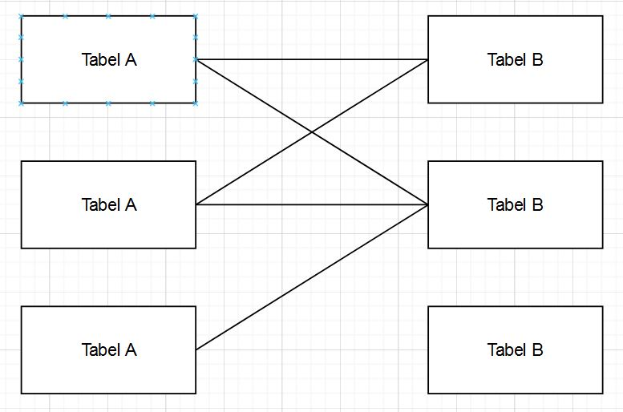
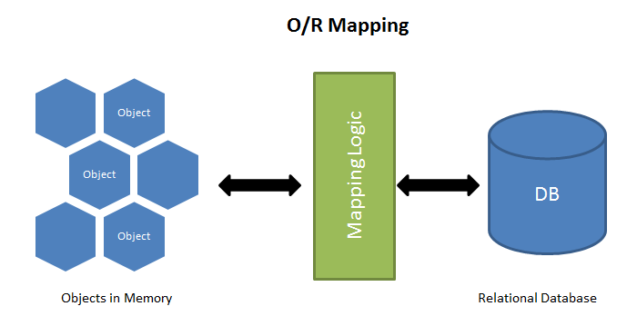

# Week-6

## A. _MySQL Lanjutan_

- Relasi dalam MySQL :
  - One to One : Relasi dimana satu baris data dari sebuah tabel hanya terhubung dengan satu baris data di tabel lain. Relasi One to One merupakan relasi yang paling jarang digunakan.
  - Contoh :
    
  - One to Many : Ketika sebuah data pada sebuah tabel memiliki relasi ke beberapa data pada tabel yang lain. Relasi One to Many merupakan relasi yang paling sering digunakan.
  - Contoh :
    
  - Many to Many : Ketika banyak data pada sebuah tabel memiliki relasi ke banyak data juga pada tabel yang lainnya.
  - Contoh :
    
- Normalisasi merupakan sebuah teknik logical desain dalam sebuah basis data yang mengelompokkan atribut dari berbagai entitas dalam suatu relasi sehingga membentuk struktur relasi yang baik (tanpa redudansi/pengulangan data) serta sebagian besar ambiguity bisa dihilangkan.
- Tujuan dari normalisasi, yaitu :
  1. Optimalisasi struktur-struktur tabel
  2. Meningkatkan kecepatan
  3. Menghilangkan pemasukan data yang sama
  4. Lebih efisien dalam penggunaan media penyimpanan
  5. Mengurangi redundansi
  6. Menghindari anomali (insertion anomalies 7. deletion anomalies, update anomalies).
  7. Meningkatkan integritas data.
- Normalisasi, tidak menjamin sebuah database model “benar”. Artinya sebuah data model yang ternormalisasi sempurna ada kemungkinan tidak bisa menghasilkan informasi yang diinginkan atau dia mampu menghasilkan informasi, tetapi prosesnya sangat lambat. Akan tetapi, Normalisasi menjamin relasi model sesuai dengan aturan sehingga peluang hasilnya efektif dan efisien tinggi.
- Bentuk Normalisasi :
  1. 1st Normal Form / 1NF :
     - Bentuk normal 1NF terpenuhi jika sebuah tabel tidak memiliki atribut bernilai banyak (multivalued attribute), atribut composite atau kombinasinya dalam domain data yang sama.
     - Setiap atribut dalam tabel tersebut harus bernilai atomic (tidak dapat dibagi-bagi lagi)
     - Bentuk ini adalah bentuk yang paling simple, tetapi paling sulit di dalam data modeling.
     - Contoh (multi value atribut) :
       
       Menjadi :
       
  2. 2nd Normal Form / 2NF :
     - Bentuk normal 2NF terpenuhi dalam sebuah tabel jika telah memenuhi bentuk 1NF, dan semua atribut selain primary key, secara utuh memiliki Functional Dependency pada primary key.
     - Sebuah tabel tidak memenuhi 2NF, jika ada atribut yang ketergantungannya (Functional Dependency) hanya bersifat parsial saja (hanya tergantung pada sebagian dari primary key).
     - Jika terdapat atribut yang tidak memiliki ketergantungan terhadap primary key, maka atribut tersebut harus dipindah atau dihilangkan.
     - Contoh
       
  3. 3rd Normal Form / 3NF :
     - Bentuk 3NF akan terpenuhi apabila memenuhi 2NF serta tidak ada atribut yang bukan kunci memiliki ketergantungan transitif (tidak secara langsung) pada primary key.
     - Contoh :
       
       (Memenuhi 2NF tetapi tidak memenuhi 3NF)
       Menjadi :
       
  4. EKNF
  5. BCNF
  6. 4NF
  7. 5NF
  8. DKNF
  9. 6NF
- Jenis-jenis keys pada SQL :
  1. Super Key :
     - Merupakan kumpulan dari satu atau lebih dari satu key yang dapat digunakan untuk mengidentifikasi record secara unik dalam sebuah tabel.
     - Super Key adalah superset dari Candidate Key.
  2. Candidate Key :
     - Merupakan kumpulan satu atau lebih fields/columns yang dapat mengidentifikasi record secara unik dalam tabel.
     - 1 tabel bisa memiliki beberapa Candidate Key.
     - Setiap Candidate Key bisa digunakan sebagai Primary Key.
     - Candidate Key merupakan super key yang tidak mempunyai value yang berulang.
  3. Primary Key :
     - Merupakan kumpulan satu atau lebih fields/columns dari sebuah tabel yang secara unik mengidentifikasi sebuah record dalam tabel database.
     - Valuenya tidak boleh berupa null ataupun duplicate value.
     - Hanya boleh salah satu Candidate Key yang bisa menjadi Primary Key.
  4. Alternate Key :
     - Merupakan key yang bisa digunakan menjadi primary key.
     - Pada dasarnya, Key ini merupakan candidate key yang tidak dijadikan primary key.
  5. Unique Key :
     - Merupakan kumpulan dari satu atau lebih fields/columns di sebuah table database yang secara unik mengidentifikasi sebuah record dalam table database tersebut.
     - Hampir sama dengan Primary key, namun value dari Unique Key bisa berupa satu buah null value di dalam sebuah table database, dan Unique Key tidak bisa memiliki duplicate value.
  6. Foreign Key :
     - Field di sebuah table database yang menjadi Primary Key di table database lain.
     - Value dari Foreign key bisa menerima multiple null dan duplicate values.
- JOIN dalam tabel MySQL :

  1. Inner JOIN

     - JOIN merupakan salah satu operasi dalam SQL yang digunakan untuk menggabungkan dua atau lebih tabel yang berbeda menjadi satu basis data. Operasi join ini dapat dilakukan jika tabel-tabel yang akan digabungkan itu memiliki key kolom yang sama.
     - Semua baris akan diambil dari kedua table yang akan di JOIN, selama columns cocok dengan kondisi yang sudah di tentukan.
     - Memungkinkan baris dari salah satu tabel muncul di hasil jika dan hanya jika kedua tabel memenuhi kondisi yang ditentukan dalam klausa ON.
     - Contoh :

       ```sql
       Membuat tabel product dan category :

       create table product(
       id int primary key not null auto_increment,
       name VARCHAR(50),
       price int,
       category_id int,
       FOREIGN KEY (category_id) REFERENCES category(id)
       );

       create table category (
       id int primary key not null auto_increment,
       name VARCHAR(25)
       );

       Mengisi data pada kedua tabel yang sudah dibuat :

       insert into category (id, name) VALUES
       (1, "Makanan"),
       (2, "Minuman"),
       (3, "Alacarte");

       insert into product (name, price,   category_id) VALUES
       ("Ayam Goreng", 15000, 1),
       ("Soda Gembira", 8000, 2),
       ("Kentang Goreng", 20000, 3);

       Menggunakan Inner Join :

       SELECT product.name as Nama Menu, count(category_id) as jumlah
       FROM product inner join category
       on product.category_id = category.id
       GROUP BY category_id;
       ```

     - Output :

       

  2. Left JOIN :

     - Pada JOIN ini, semua records dari table di sisi kiri JOIN statement akan di pilih.
     - Jika record yang di pilih dari table kiri tidak memiliki record yang cocok pada table JOIN yang kanan, maka record tersebut masih dipilih, dan kolom pada table yang kanan akan bernilai NULL.
     - Contoh :

       ```sql
       Tabel yang digunakan sama seperti Inner JOIN :

       SELECT product.name as Nama Menu, count(category_id) as jumlah
       FROM product left join category
       on product.category_id = category.id
       GROUP BY category_id;
       ```

     - Output :

       

  3. Right JOIN :
     - Pada JOIN ini, semua records dari table di sisi kiri JOIN statement akan di pilih, bahkan jika table di sebelah kiri tidak memiliki record yang cocok.

- Aggregate Functions dalam MySQL :
  1. MAX
     - Mengembalikan nilai terbesar dari kolom yang dipilih.
     - Contoh :
       ```sql
       SELECT MAX(score)
       FROM student
       WHERE gender = "cowok"
       ```
  2. MIN
     - Fungsi mengembalikan nilai terkecil dari kolom yang dipilih.
     - Contoh :
       ```sql
       SELECT MIN(score)
       FROM student
       WHERE gender = "cowok"
       ```
  3. SUM
     - Fungsi mengembalikan jumlah total kolom numerik.
     - Contoh :
       ```sql
       SELECT SUM(score)
       FROM student
       WHERE gender = "cowok"
       ```
  4. COUNT
     - Fungsi mengembalikan jumlah baris yang cocok dengan kriteria yang ditentukan.
     - Contoh :
       ```sql
       SELECT COUNT(score)
       FROM student
       WHERE gender = "cowok"
       ```
  5. AVG
     - Fungsi mengembalikan nilai rata-rata kolom numerik
     - Contoh L
       ```sql
       SELECT AVG(score)
       FROM student
       WHERE gender = "cowok"
       ```
- Fungsi UNION pada SQL digunakan untuk menggabungkan dua tabel dalam bentuk baris baru ke bawah dimana field yang di-SELECT antara tabel satu dan lainnya adalah harus sama. Atau sederhananya yaitu untuk menempatkan baris dari kueri satu sama lain dan nilainya distinct/unik.
- GROUP BY digunakan untuk mengelompokkan data (record) yang memiliki nilai yang sama. seperti “menemukan jumlah data barang sesuai dengan kategori”. SQL GROUP BY sering digunakan pada Aggregat Function seperti (COUNT(), MAX(), MIN(), SUM(), AVG()) yang menampilkan beberapa kolom.
- HAVING digunakan dalam kombinasi dengan clause MySQL Group By untuk membatasi kelompok baris yang dikembalikan hanya kepada mereka yang kondisinya benar.
- Operator LIKE digunakan dalam klausa WHERE untuk mencari pola tertentu dalam kolom.
- Karakter wildcard digunakan untuk menggantikan satu atau lebih karakter dalam sebuah string.
- Contoh
  ```sql
  SELECT name
  FROM student
  WHERE name LIKE "%ra%"
  ```

## B. _Authentication & Authorization in Express_

- Autentikasi sering disebut sebagai validasi data pengguna ketika ingin memasuki sistem tertentu. Ada beberapa aplikasi web memberikan kombinasi nama user/password atau email, melalui pihak ketiga, seperti lewat akun Twitter atau Facebook. Pengguna yang tampa melalui otentikasi disebut anonymous, atau guest/tamu.
- Faktor utama autentikasi :
  1. Sesuatu yang kita tahu seperti email / username dan password.
  2. Sesuatu yang kita punya seperti handphone atau security card.
  3. Sesuatu yang menggambarkan identitas diri kita seperti fingerprints.
- Autentikasi yang bergantung pada satu faktor, seperti kombinasi username dan password, disebut autentikasi Satu faktor, dan itu termasuk tidak aman.
- Authorization adalah proses selanjutnya setelah authentication berhasil. Sistem akan memberikan akses sesuai kebijakan yang sudah ditentukan sebelumnya. Di sini sistem akan memberikan batasan akses yang akan diberikan kepada karyawan yang sudah login tersebut. Tentu saja sebelumnya sudah ada rancangan pembatasan akses untuk mencegah terjadinya fraud atau kecurangan dalam perusahaan.
- Contoh :
  ```sh
  Karyawan yang login dan dia hanya bisa mengajukan pembayaran kepada vendor. Ada karyawan lain yang login dan dia hanya bisa melakukan persetujuan pembayaran ke vendor. Kemudian ada karyawan yang lain juga yang hanya dapat melakukan pengajuan pembayaran dan karyawan lain yang melakukan pembayaran sesuai pengajuan tadi.
  ```
- Authorization yang baik akan memungkinkan Anda membatasi pengguna dan layanan untuk hak istimewa yang mereka butuhkan.
- Enkripsi adalah cara mengacak data sehingga informasi tersebut hanya bisa dibaca oleh orang-orang yang memiliki aksesnya saja. Secara teknis, encryption adalah proses konversi teks biasa yang terbaca manusia (human-readable plaintext) menjadi teks yang tidak bisa dibaca dan dimengerti (incomprehensible text).
- Data atau teks yang terenkripsi itu umumnya disebut sebagai _ciphertext_.
- Garis besar cara kerja enkripsi :
  1. Mengetahui terlebih dahulu apa cipher atau sandi yang akan digunakan untuk menyembunyikan makna asli dari sebuah teks.
  2. Tentukanlah juga variabel yang digunakan sebagai kuncinya.
  3. Jika sebuah enkripsi menggunakan satu kunci saja, hal itu disebut symmetric cipher.
  4. jika suatu enkripsi menggunakan dua kunci yang saling berhubungan, hal itu disebut asymmetric cipher.
- Web Session mengacu pada serangkaian interaksi pengguna selama jangka waktu tertentu. _Session Data_ disimpan di sisi server dan dihubungkan dengan ID sesi.
- Kita anggap Session sebagai _short-term memory_ untuk aplikasi web. _Session identifier_ disimpan sehingga browser (klien) dapat terus mengambil data sesi yang sama di antara pemuatan halaman yang berbeda.
- Session ID sering disimpan pada client dalam bentuk Session Cookies.
- Cookie adalah istilah untuk kumpulan informasi yang berisi rekam jejak dan aktivitas ketika menelusuri sebuah website. Secara sederhana pengertian cookies adalah kumpulan data yang diterima komputer dari sebuah situs dan mengirimkan kembali ke situs yang dikunjungi.
- Ukuran cookies umumnya kurang dari 100 bytes, sehingga tidak akan mempengaruhi kecepatan browsing. Akan tetapi karena umumnya browser diatur secara default untuk menerima Cookies maka pengguna tidak akan mengetahui bahwa Cookies telah tersimpan di komputer.
- Contoh implementasi Session dengan Cookies :
  ```sh
  Website e-commerce menggunakannya untuk meningkat produk apa saja yang kamu masukkan keranjang.
  ```
- Cookie sering menyimpan informasi sensitif, terutama saat digunakan dalam _Session Management_. Cookie juga digunakan untuk menyimpan preferensi atau riwayat pribadi pengguna, yang juga harus tetap aman.
- Langkah pertama untuk mengamankan sebuah cookie adalah dengan menambahkan tanggal kedaluwarsa atau durasi sehingga cookie tidak bertahan terlalu lama.
- Contoh (Memasukkan informasi pada header Set-Cookie pada HTTP Response) :
  ```js
  Set-Cookie: Key=Value; expires=Sunday, 20-Jan-2022 08:10:10 GMT
  ```
- JSON Web Token yaitu sebuah JSON Object yang digunakan untuk aktifitas transfer informasi antar platform. JSON Web Token dapat berfungsi untuk sistem autentikasi dan juga untuk pertukaran informasi. JSON (Javascript Object Notation) berbentuk string panjang yang sangat random, lalu token ini memungkinkan kita untuk mengirimkan data yang dapat diverifikasi oleh dua pihak atau lebih. Token ini terdiri dari header, payload dan signature.
- Struktur JWT :
  1. Header : Biasanya terdiri dari dua bagian jenis token, yaitu JWT dan algoritma penandatanganan yang digunakan, seperti HMAC SHA256 atau RSA.
     - Contoh :
     ```js
     const header = { alg: "HS256", typ: "JWT" };
     const encodedHeader = Buffer.from(JSON.stringify(header)).toString("base64");
     ```
  2. Payload : Sebagai infomasi atau data yang ingin kita kirimkan. Dalam penerapannya di otentikasi atau pun otorisasi, biasanya data ini berupa data yang sifatnya unik bagi user, seperti: email, id/uuid, dan juga data yang berkaitan dengan otorisasi seperti role, karena data tersebut akan digunakan sebagai tanda pengenal si pengirim token.
     - Contoh :
     ```js
     const payload = { username: "Rafi" };
     const encodedPayload = Buffer.from(JSON.stringify(payload)).toString("base64");
     ```
  3. Signature : Hasil dari Hash atau gabungan dari isi encode Header dan Payloadnya lalu ditambahkan kode secretnya. Signature ini berguna untuk memverifikasi bahwa header maupun payload yang ada dalam token tidak berubah dari nilai aslinya (karena untuk membuat payload dan header palsu itu cukup mudah).
     - Contoh :
       ```js
       HMACSHA256(base64UrlEncode(header) + "." + base64UrlEncode(payload), secret);
       ```
- Cara kita menggunakan informasi pada JWT ketika berkomunikasi dengan server :
  1. User login pada website dan informasinya akan dikirimkan pada sevrer.
  2. Server membuat sebuah JWT dengan _secret_
  3. JWT dikembalikan pada browser.
  4. User membuat Request lain dan browser mengirimkan JWT kembali pada server pada header autorisasi menggunakan _Bearer Schema_.
  5. Server melakukan verifikasi signature dan mendapatkan informasi User dari JWT.
  6. Server akan mengirimkan respon balik pada browser. Ketika JWT valid, browser akan menerima apa yang diminta oleh User, ketika tidak valid maka browser akan menerima sebuah pesan mengenai kesalahan.
- Hashing adalah proses mengacak sebuah karakter dan mengembalikannya dalam sebuah karakter random, dan selalu sepanjang 60 karakter. Hashing membuat password menjadi aman dan tidak dapat dilihat lagi kontennya. Salting adalah proses menambahkan data unik kedalam proses hashing, dan akan tersimpan dalam hash tersebut.
- JWT pada npmjs :

  1. Menginstall 'jsonwebtoken'
     ```js
     $ npm install jsonwebtoken
     ```
  2. Memanggil jwt dari Dependency
     ```js
     const jwt = requires("jsonwebtoken");
     ```
  3. Sign secara asynchronous

     ```js
     const KEY = "qwfuiasidfiuasuif";
     const token = jwt.sign({ email }, KEY);
     ```

## C. _Sequalize_

- Sequelize adalah promise-based ORM untuk nodejs. ORM (Object Relational Maping) adalah sebuah tool yang kita gunakan sebagai cara kita melakukan interaksi dengan database pilihan kita tanpa harus mempelajari domain spesific language kita hanya berinteraksi dengan pertara api yang sudah disediakan. Ketika pengembangan nanti kita tidak perlu melakukan perubahan konteks saat menuliskan kode karena kita melakukan interaksinya menggunakan bahasa javascript melalui api yang sudah disediakan oleh Sequelize.
- Salah satu fitur yang terdapat pada Sequelize yaitu dapat mengambil API yang sama pada database yang berbeda.
- Object Relational Mapping (ORM) adalah salah satu teknik untuk memetakan basisdata relasional ke model objek. Dari hasil penelitian disimpulkan bahwa Hibernate mampu melakukan pemetaan serta menyederhanakan proses penyimpanan dan pengambilan data objek.
- Gambaran ORM :

  

- Instalasi Sequelize-cli :
  ```js
  npm install -g sequelize-cli
  ```
- Ketika kita melakukan inisiasi project kita pertama perlu menginstall sequelize menggunakan npm install sequelize dan perlu menginstall driver sql yang kita butuhkan :

  ```js
  npm install sequelize

  npm install mysql2
  ```

- Sequelize init :
  ```js
  npx sequelize-cli init
  ```
- Kita bisa menggunakan generate dan kita bisa mengecek ke database sehingga dapat kita gunakan untuk penimpanan DB :
  ```js
  npx sequelize-cli db:migrate
  ```
- Kita juga bisa undo ketika ada kesalahan :
  ```js
  npx sequelize-cli db:migrate:undo
  ```

## D. _Database_

- Database adalah kumpulan data yang terorganisir, yang umumnya disimpan dan diakses secara elektronik dari suatu sistem komputer. Pada saat database menjadi semakin kompleks, maka pangkalan data dikembangkan menggunakan teknik perancangan dan pemodelan secara formal.
- Untuk membuat Database diperlukan sebuah software yang dinamakan dengan DBMS(Database Management System).
- DBMS adalah software yang dapat digunakan oleh user untuk berkomunikasi dengan data yang ada dalam media penyimpanan.
- Table adalah kumpulan value yang dibangun oleh baris dan kolom, yang didalamnya berisikan atribut dari sebuah data.
- Field adalah kolom dari sebuah tabel dimana masing-masing field memiliki tipe data masing-masing.
- Record merupakan kumpulan nilai yang saling terkait. Record merupakan isi dari sebuah tabel.
- SQL adalah sebuah bahasa yang digunakan untuk mengakses data dalam basis data relasional. Bahasa ini secara de facto merupakan bahasa standar yang digunakan dalam manajemen basis data relasional. Saat ini hampir semua server basis data yang ada mendukung bahasa ini untuk melakukan manajemen datanya.
- SQL adalah Bahasa Query yang digunakan untuk melakukan interaksi di RDMS (Relational Database Management System).
- DDL (Data Definition Languange) merupakan sekumpulan set perintah yang bertujuan untuk mendefinisikan atribut – atribut database, tabel, atribut kolom (field), maupun batasan – batasan terhadap suatu atribut dan relasi/hubungan antar tabel.
- Yang termasuk ke dalam DDL, yaitu :

  1. Alter :

     - Digunakan untuk mengubah struktur dari tabel yang ada, seperti untuk menambahkan atau menghapus kolom/fiel,membuat atau menghapus primary key, mengubah jenis kolom/field yang ada, juga mengubah kolom atau nama tabel.
     - Contoh :
       ```sql
       ALTER TABLE 'nama tabel' ADD primary key ('nama field')
       ```

  2. Drop :

     - Perintah Drop digunakan untuk menghapus Database, Table, dan View atau Index.
     - Contoh :
       ```sql
       DROP TABLE 'nama tabel'
       ```

- Data Manilation Language (DML) merupakan bahasa basis data yang dipergunakan untuk melakukan modifikasi dan retrieve (pengambilan) data pada suatu basis data.
- Yang termasuk kedalam DML, yaitu :

  1. SELECT :

     - Digunakan untuk menyeleksi data berdasarkan syarat yang diberikan.
     - Contoh :
       ```sql
       SELECT * FROM 'nama tabel'
       ```

  2. INSERT :

     - Digunakan untuk memasukkan data ke kolom-kolom yang terdapat pada tabel/view.
     - Contoh :
       ```sql
       INSERT INTO 'nama tabel' VALUES '(value1, value2, ...... , valueX)
       ```

- Tipe data pada MySQL :
  1. Number : int, float, decimal
  2. String : char, varchar, text, enum
  3. boolean : TRUE dan FALSE
  4. Date time : DATE, DATETIME, TIME, timestamp
  5. Data type lain : DEFAULT, NULL
- Jenis key pada MySQL : 
  1. Primary key : Sebuah key yang berfungsi untuk membedakan antara baris satu dengan baris lain pada tabel dan bersifat unik atau berbeda setiap barisnya.
  2. Foreign key : Sebuah atribut atau gabungan atribut yang terdapat dalam suatu tabel yang digunakan untuk menciptakan hubungan atau relasi antara dua tabel.
- List beberapa database Command : 
  1. **SHOW DATABASE** : untuk menunjukkan semua list yang ada pada database mysql.
  2. **CREATE DATABASE 'nama database'** : Untuk membuat database baru.
      - Contoh :
        ```sql
        CREATE DATABASE mahasiswa
        ```
  3. **USE 'nama database'** : Untuk menggunakan database yang sudah kita buat.
        - Contoh :
          ```sql
          USE mahasiswa
          ```
  4. **DROP DATABASE 'nama database** : Untuk menghapus database yang ada pada MySQL.
        - Contoh :
            ```sql
            DROP DATABASE mahasiswa
            ```
  5. **SHOW TABLES** : Untuk menunjukkan / melihat semua tabel yang ada pada database kita.
  6. **CREATE TABLE 'nama tabel'** : Untuk membuat tabel baru pada database.
        - Contoh :
            ```sql
            CREATE TABLE mahasiswa
            ```
  7. **DROP TABLE 'nama tabel** : Untuk menghapus tabel yang ada pada suatu database.
        - Contoh :
            ```sql
            DROP TABLE mahasiswa
            ```
  8. **WHERE** : Digunakan untuk mencari data dengan kondisi tertentu
    - Contoh : 
      ```sql
      SELECT score FROM mahasiswa WHERE id = 1
      ```
  9. **AND** : Menampilkan record jika semua kondisi dipisahkan oleh AND adalah benar.
  10. **OR** : Menampilkan record jika ada kondisi yang dipisahkan oleh OR adalah benar.
  11. **NOT** : Digunakan untuk mencari query yang tidak ada dalam kondisi yang di definisikan.
  12. **ORDER BY** : Digunakan untuk mengurutkan hasil set data dalam urutan dari “kecil” ke “besar” atau dari “A” ke “Z”, atau sebaliknya.
  13. **GROUP BY** : Digunakan untuk mengelompokkan data dalam sebuah kolom yang ditunjuk.
  14. **LIMIT** : Digunakan untuk membatasi berapa query yang akan dimunculkan dengan urutan dari atas.
      - Contoh : 
        ```sql
        SELECT * FROM mahasiswa LIMIT 1
        ```
  15. **UPDATE** : Digunakan untuk melakukan perbaruan data di table.
        - Contoh : 
          ```sql
          UPDATE mahasiswa SET nama ='Rafi', umur = 20 WHERE id = 1 
          ```
  16. **DELETE** : Digunakan untuk melakukan penghapusan data
      - Contoh : 
        ```sql
        DELETE FROM mahasiswa WHERE id = 1
        ```
