# Week 7

## A. _Sequelize_

- Sequelize adalah promise-based ORM untuk nodejs. ORM (Object Relational Maping) adalah sebuah tool yang kita gunakan sebagai cara kita melakukan interaksi dengan database pilihan kita tanpa harus mempelajari domain spesific language kita hanya berinteraksi dengan pertara api yang sudah disediakan. Ketika pengembangan nanti kita tidak perlu melakukan perubahan konteks saat menuliskan kode karena kita melakukan interaksinya menggunakan bahasa javascript melalui api yang sudah disediakan oleh Sequelize.
- Salah satu fitur yang terdapat pada Sequelize yaitu dapat mengambil API yang sama pada database yang berbeda.
- Object Relational Mapping (ORM) adalah salah satu teknik untuk memetakan basisdata relasional ke model objek. Dari hasil penelitian disimpulkan bahwa Hibernate mampu melakukan pemetaan serta menyederhanakan proses penyimpanan dan pengambilan data objek.
- Gambaran ORM :

  

- Instalasi Sequelize-cli :
  ```js
  npm install -g sequelize-cli
  ```
- Ketika kita melakukan inisiasi project kita pertama perlu menginstall sequelize menggunakan npm install sequelize dan perlu menginstall driver sql yang kita butuhkan :

  ```js
  npm install sequelize

  npm install mysql2
  ```

- Sequelize init :
  ```js
  npx sequelize-cli init
  ```
- Generate model pada Sequelize (Membuat tabel user) :
  ```js
  npx sequelize-cli model:generate --name User --attributes name:string,email:string,password:string
  ```
  - Maka akan terbentuk file user.js pada file models yang berisi :

    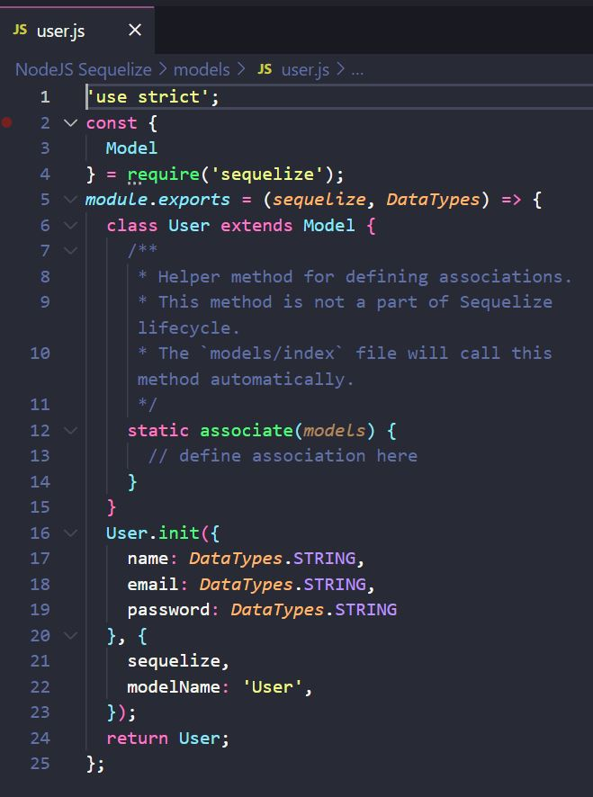
- Selanjutnya kita bisa menggunakan generate dan cek pada database sehingga dapat digunakan untuk penyimpanan DB
  ```js
  npx sequelize-cli db:migrate
  ```
- Kita juga bisa melakukan undo ketika ada kesalahan :
  ```js
  npx sequelize-cli db:migrate:undo
  ```
- Kita bisa menggunakan Mysql Workbench untuk cek apakah kita berhasil melakukan generate / tidak. Ketika kita berhasil melakukan generate maka kita dapat melihat pada database terdapat 1 tabel baru yang bernama users dan sequelizemeta.

  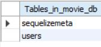

- Seed merupakan bawaan dari sequelize, dimana seed berfungsi untuk memberikan data awal / data dummy.
  ```js
  npx sequelize seed:create --name demo-user
  ```
- Ketika berhasil melakukan generate maka kita dapat melakukan pengisian data seed (menggunakan **bulkInsert**) didalam file seed generator (up untuk mengisi data, down untuk menghapus data seed).

  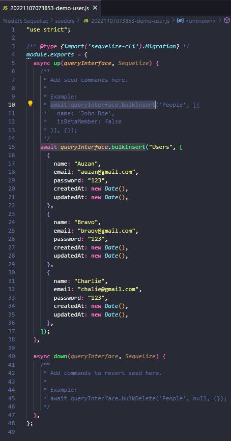

- Lalu kita jalankan generate seed dengan sequelize
  ```js
  npx sequelize-cli db:seed:all
  ```
- Jika terdapat kesalahan kita bisa melakukan undo seperti migrate
  ```js
  npx sequelize-cli db:seed:undo
  ```
- Ketika kita berhasil melakukan generate, kita bisa cek pada database bahwa data kita telah berhasil di insert ke db (disini saya cek menggunakan MySQL Workbench)

  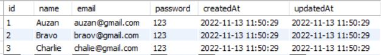

- Untuk mendapatkan data yang sudah kita buat, kita bisa melakukan :
  - Membuat file user.router.js
    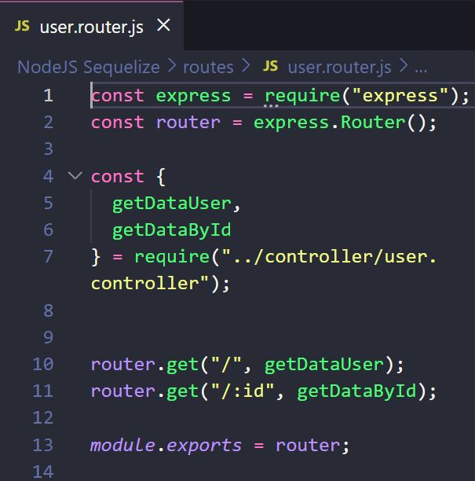
  - Setelah itu kita sambungkan file router tersebut dengan controller agar terlihat lebih rapi (user.controller.js) :
    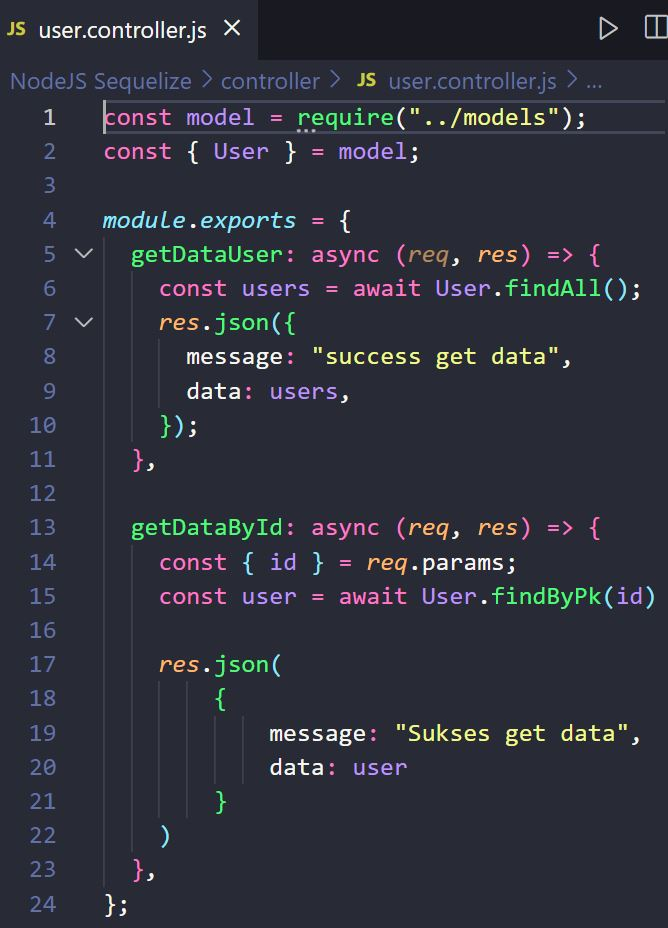
  - Pada file controller kita bisa membuat syntax untuk mendapatkan semua data user (getDataUser) yang sudah kita bisa serta bisa mencari data user berdasarkan id (getDataByID).

## B. _MongoDB_

- MongoDB adalah salah satu jenis database NoSQL yang cukup populer digunakan dalam pengembangan website. Berbeda dengan database jenis SQL yang menyimpan data menggunakan relasi tabel, MongoDB menggunakan dokumen dengan format JSON.
- Contoh perusahaan besar yang menggunakan MongoDB yaitu : Google, Adobe, dan Ebay.
- NoSQL merupakan singkatan dari Not Only SQL
- NoSQL merupakan istilah yang dikenal dalam teknologi komputasi untuk merujuk kepada kelas yang luas dari sistem manajemen basis data yang di identifikasikan dengan tidak mematuhi aturan pada model sistem manajemen basis data relasional yang banyak digunakan.
- Document merupakan unit terkecil yang berada pada MongoDB
- Contoh bentu data pada MongoDB :

  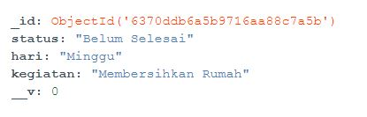

- Kita dapat menggunakan GUI Tools Official dari MongoDB yaitu MongoDB Compass
- Untuk melihat database yang aktif, bisa gunakan db pada MongoDB shell
- Untuk melihat daftar database bisa menggunakan show dbs

  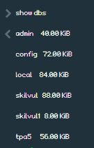

- Kita bisa gunakan db.createCollections("Nama Collection") untuk menambahkan Collection baru.
- Kita bisa gunakan db.'nama db'.insert({'nama atribut'}) untuk menambahkan data pada Collection.
- db.'nama db'.find() untuk melihat data yang kita gunakan
- Untuk mengupdate data pada Collection kita bisa gunakan db.'nama db'.update({'nama atribut'}, {$set:{'isi dari apa yang ingin kita ubah'}}
- db.'nama db'.remove({'nama atribut'}) untuk menghapus data pada collection.
- Jika kita mendesain schema aplikasi MongoDB kita sama dengan mendesain SQL maka kita akan banyak kehilangan fitur MongoDB.
- Terdapat 2 penedkatan ketika kita mendesain MongoDB yaitu Embedding dan Referencing.
- Embedding yaitu ketika memasukan semua data yang terkait dalam satu dokumen. Sedangkan Referencing yaitu ketika hanya memasukan data sebagian saja tidak keseluruhan.
- Contoh dari Embedding :

  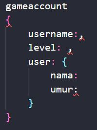
- Contoh dari Referencing :

  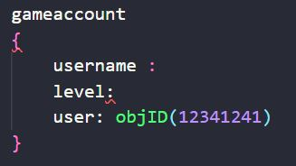
- Relasi dalam MongoDB :
  - One to One : Lebih baik jika menggunakan Embedded
  - One to Many : Lebih baik jika menggunakan Reference
  - Many to Many : Lebih baik jika menggunakan Reference
- Kita tidak perlu terlalu berpatokan dengna  embedded atau reference, kita hanya perlu mendesain sesuai dengan kebutuhan aplikasi saja.
## C. _Mongoose_
- Mongoose merupakan sebuah module pada NodeJS yang di install menggunakan npm, berfungsi sebagai penghubung antara NodeJS dan database nosql MongoDB. Mongoose menyediakan fitur diantaranya, model data application berbasis Schema. Dan juga termasuk built-in type casting, validation, query building, business logic hooks dan masih banyak lagi yang menjadi ke andalan mongoose.
- Instalasi mongoose : 
  ```js
  npm install mongoose
  ```
- Membuat koneksi dengan MongoDB database :
  - Contoh : 
    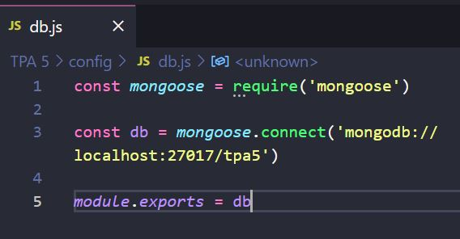

    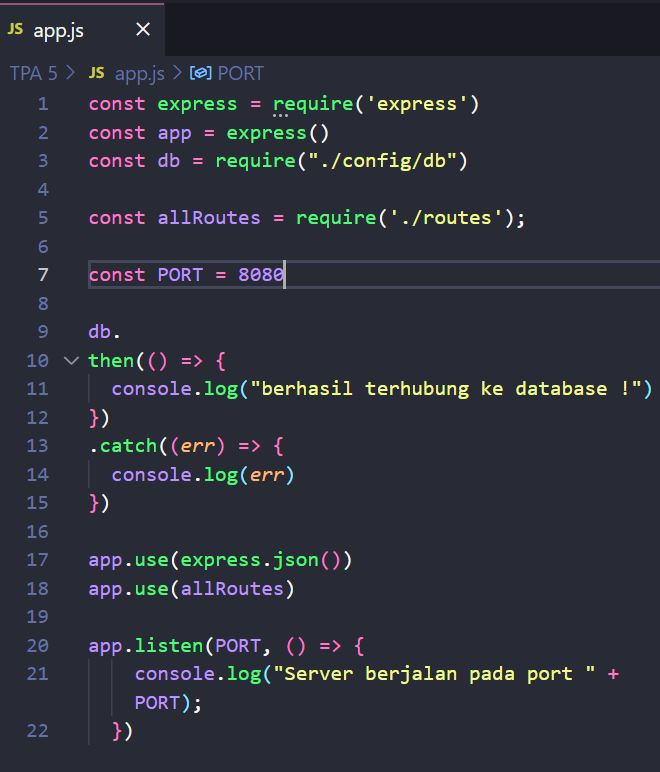
- Lalu kita bisa jalankan file app.js untuk mengetahui berhasil terkoneksi ke database / tidak

  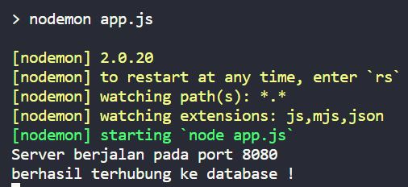
- Mendefinisikan sebuah Schema serta tipe data untuk setiap field yang akan digunakan. :

  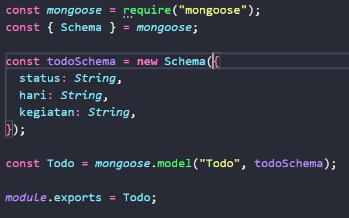
- Kita juga bisa memberikan validasi data, seperti untuk field yang wajib diisi dengan menambahkan 'required: true'.
- Lalu pada file controller, kita tambahkan potongan kode dibawah ini untuk menggunakan model **Todo** dari Schema yang sudah kita buat dengan tujuan digunakan untuk CRUD.

  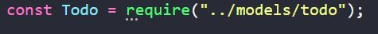
- Contoh CRUD : 
  - Menambahkan data dengan method POST :

    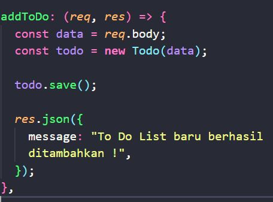
  - Mendapatkan seluruh data dengan menthod GET :

    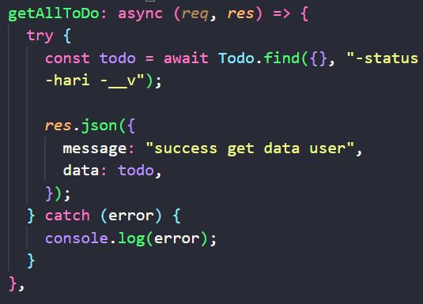
  - Melakukan update 1 data berdasarkan id :

    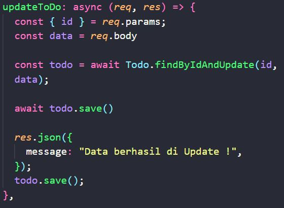
  - Menghapus 1 data tertentu berdasarkan id serta menghapus seluruh data yang ada :

    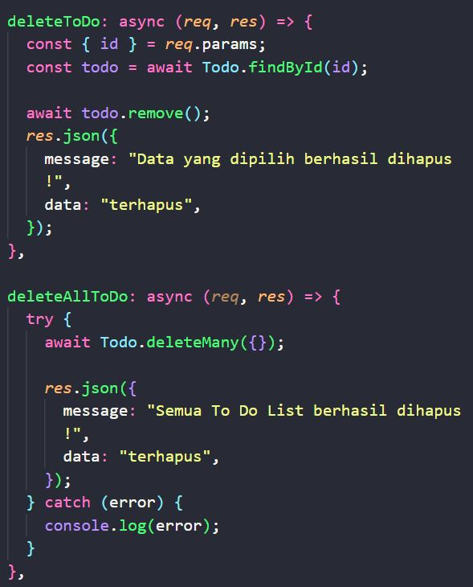
- Populate ada kaitannya dengan relasi database. Populate adalah proses penggabungan 2 collection atau lebih menjadi satu objek JSON.
## D. _Docker_
- Docker adalah layanan yang menyediakan kemampuan untuk mengemas dan menjalankan sebuah aplikasi dalam sebuah lingkungan terisolasi yang disebut dengan container. Dengan adanya isolasi dan keamanan yang memadai memungkinkan kamu untuk menjalankan banyak container di waktu yang bersamaan pada host tertentu.
- Docker men-sharing kernel dari host OS, serta meng-container-kan suatu aplikasi agar dapat dijalankan dimana saja dan kapan saja.
- Aplikasi yg berjalan di dalam container docker tidak terpengaruh oleh faktor luar karena terisolasi.
- Docker berfungsi sebagai penyedia layanan virtual bagi aplikasi yg diinstall pada sebuah host. 
- Docker akan menyediakan hal-hal yang diperlukan untuk aplikasi mulai dari akses file, koneksi internet, hingga port agar aplikasi dapat berjalan dengan mulus.
-VM (Virtual Machine) memakan banyak resource dan waktu utk booting karena melakukan virtualisasi pada host hardware-nya. Sedangkan container merupakan kebalikan dari Virtual Machine, container melakukan virtualisasi pada host OS-nya.
- Fundamental dari Docker :
  - Docker File : Merupakan blueprint untuk membuat image
    - Cara membuat Docker File : 
      1. Buat file dockerfile pada project yang kita buat
      2. Tulis beberapa perintah ke dalam dockerfile
      3. Jalankan dockerfile dengan perintah :
        ```sh
        docker build -t NAMA_IMAGE:TAG.
        ```   
  - Image : Merupakan Template untuk menjalankan container
  - Container : Merupakan perwujudan dari Image
  - Docker Registry : Merupakan tempat untuk upload/download Image
- Instalasi Docker :

  ```sh
  docs.docker.com/get-docker
  ```
- Perintah Dasar dalam Docker : 
  - docker pull : Untuk download image dari docker hub
  - docker images : Untuk melihat kumpulan images yang telah terdownload
  - docker run : Untuk menjalankan container
  - docker ps : Untuk melihat container yang sedang berjalan
- Docker compose merupakan sebuah cara untuk menjalankan lebih dari 1 container secara bersama-sama dan saling terhubung 1 sama lain.
 - Cara melakukan Docker Compose, yaitu :
    1. Buat file NAMA_FILE.yaml pada project yang kita buat.
    2. Tulis beberapa perintah di dalamnya.
    3. Jalankan dengan perintah : 
        ```sh
        docker-compose NAMA_FILE.yaml up
        ```  
